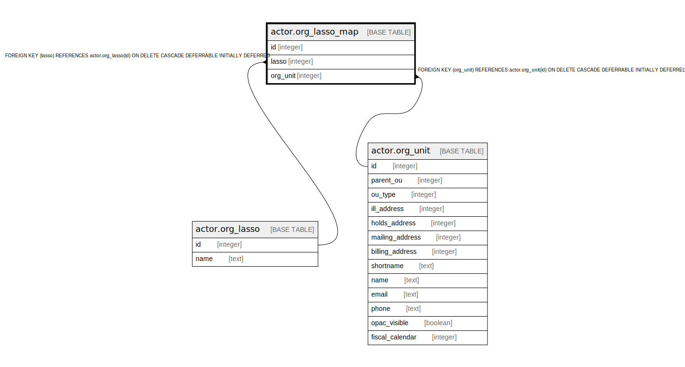

# actor.org_lasso_map

## Description

## Columns

| Name | Type | Default | Nullable | Children | Parents | Comment |
| ---- | ---- | ------- | -------- | -------- | ------- | ------- |
| id | integer | nextval('actor.org_lasso_map_id_seq'::regclass) | false |  |  |  |
| lasso | integer |  | false |  | [actor.org_lasso](actor.org_lasso.md) |  |
| org_unit | integer |  | false |  | [actor.org_unit](actor.org_unit.md) |  |

## Constraints

| Name | Type | Definition |
| ---- | ---- | ---------- |
| org_lasso_map_pkey | PRIMARY KEY | PRIMARY KEY (id) |
| org_lasso_map_lasso_fkey | FOREIGN KEY | FOREIGN KEY (lasso) REFERENCES actor.org_lasso(id) ON DELETE CASCADE DEFERRABLE INITIALLY DEFERRED |
| org_lasso_map_org_unit_fkey | FOREIGN KEY | FOREIGN KEY (org_unit) REFERENCES actor.org_unit(id) ON DELETE CASCADE DEFERRABLE INITIALLY DEFERRED |

## Indexes

| Name | Definition |
| ---- | ---------- |
| org_lasso_map_pkey | CREATE UNIQUE INDEX org_lasso_map_pkey ON actor.org_lasso_map USING btree (id) |
| ou_lasso_lasso_ou_idx | CREATE UNIQUE INDEX ou_lasso_lasso_ou_idx ON actor.org_lasso_map USING btree (lasso, org_unit) |
| ou_lasso_org_unit_idx | CREATE INDEX ou_lasso_org_unit_idx ON actor.org_lasso_map USING btree (org_unit) |

## Relations

---

> Generated by [tbls](https://github.com/k1LoW/tbls)
