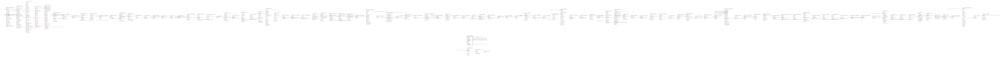

# actor.org_unit

## Description

## Columns

| Name | Type | Default | Nullable | Children | Parents | Comment |
| ---- | ---- | ------- | -------- | -------- | ------- | ------- |
| id | integer | nextval('actor.org_unit_id_seq'::regclass) | false | [config.circ_matrix_matchpoint](config.circ_matrix_matchpoint.md) [action.circulation](action.circulation.md) [actor.usr](actor.usr.md) [asset.copy](asset.copy.md) [action.hold_request](action.hold_request.md) [actor.address_alert](actor.address_alert.md) [actor.usr_standing_penalty](actor.usr_standing_penalty.md) [actor.org_unit](actor.org_unit.md) [actor.org_unit_setting](actor.org_unit_setting.md) [config.marc_field](config.marc_field.md) [config.marc_subfield](config.marc_subfield.md) [config.z3950_source_credentials](config.z3950_source_credentials.md) [serial.pattern_template](serial.pattern_template.md) [acq.purchase_order](acq.purchase_order.md) [acq.fund](acq.fund.md) [acq.funding_source](acq.funding_source.md) [acq.cancel_reason](acq.cancel_reason.md) [acq.claim_event_type](acq.claim_event_type.md) [acq.claim_policy](acq.claim_policy.md) [acq.claim_type](acq.claim_type.md) [acq.distribution_formula](acq.distribution_formula.md) [acq.distribution_formula_entry](acq.distribution_formula_entry.md) [config.remote_account](config.remote_account.md) [acq.fund_allocation_percent](acq.fund_allocation_percent.md) [acq.fund_tag](acq.fund_tag.md) [acq.invoice](acq.invoice.md) [acq.lineitem_alert_text](acq.lineitem_alert_text.md) [acq.lineitem_detail](acq.lineitem_detail.md) [acq.picklist](acq.picklist.md) [acq.provider](acq.provider.md) [acq.user_request](acq.user_request.md) [asset.call_number](asset.call_number.md) [action.in_house_use](action.in_house_use.md) [action.non_cat_in_house_use](action.non_cat_in_house_use.md) [action.non_cataloged_circulation](action.non_cataloged_circulation.md) [action.curbside](action.curbside.md) [action.fieldset](action.fieldset.md) [action.fieldset_group](action.fieldset_group.md) [action.transit_copy](action.transit_copy.md) [action.survey](action.survey.md) [action_trigger.event_def_group](action_trigger.event_def_group.md) [action_trigger.event_definition](action_trigger.event_definition.md) [actor.copy_alert_suppress](actor.copy_alert_suppress.md) [actor.hours_of_operation](actor.hours_of_operation.md) [actor.org_address](actor.org_address.md) [actor.org_lasso_map](actor.org_lasso_map.md) [actor.org_unit_closed](actor.org_unit_closed.md) [actor.org_unit_custom_tree_node](actor.org_unit_custom_tree_node.md) [actor.org_unit_proximity_adjustment](actor.org_unit_proximity_adjustment.md) [actor.search_filter_group](actor.search_filter_group.md) [actor.stat_cat](actor.stat_cat.md) [actor.stat_cat_entry](actor.stat_cat_entry.md) [actor.stat_cat_entry_default](actor.stat_cat_entry_default.md) [actor.toolbar](actor.toolbar.md) [actor.usr_message](actor.usr_message.md) [actor.usr_org_unit_opt_in](actor.usr_org_unit_opt_in.md) [actor.workstation](actor.workstation.md) [asset.call_number_prefix](asset.call_number_prefix.md) [asset.call_number_suffix](asset.call_number_suffix.md) [asset.copy_location](asset.copy_location.md) [asset.copy_location_group](asset.copy_location_group.md) [asset.copy_location_order](asset.copy_location_order.md) [asset.copy_tag](asset.copy_tag.md) [asset.copy_template](asset.copy_template.md) [asset.course_module_course](asset.course_module_course.md) [asset.course_module_term](asset.course_module_term.md) [asset.stat_cat](asset.stat_cat.md) [asset.stat_cat_entry](asset.stat_cat_entry.md) [biblio.record_entry](biblio.record_entry.md) [booking.reservation](booking.reservation.md) [booking.resource](booking.resource.md) [booking.resource_attr](booking.resource_attr.md) [booking.resource_attr_value](booking.resource_attr_value.md) [booking.resource_type](booking.resource_type.md) [config.barcode_completion](config.barcode_completion.md) [config.billing_type](config.billing_type.md) [config.circ_limit_set](config.circ_limit_set.md) [config.copy_alert_type](config.copy_alert_type.md) [config.copy_tag_type](config.copy_tag_type.md) [config.filter_dialog_filter_set](config.filter_dialog_filter_set.md) [config.floating_group_member](config.floating_group_member.md) [config.hold_matrix_matchpoint](config.hold_matrix_matchpoint.md) [config.idl_field_doc](config.idl_field_doc.md) [config.org_unit_setting_type_log](config.org_unit_setting_type_log.md) [config.print_template](config.print_template.md) [config.remoteauth_profile](config.remoteauth_profile.md) [config.weight_assoc](config.weight_assoc.md) [container.biblio_record_entry_bucket](container.biblio_record_entry_bucket.md) [container.call_number_bucket](container.call_number_bucket.md) [container.carousel](container.carousel.md) [container.carousel_org_unit](container.carousel_org_unit.md) [container.copy_bucket](container.copy_bucket.md) [container.user_bucket](container.user_bucket.md) [money.collections_tracker](money.collections_tracker.md) [permission.grp_penalty_threshold](permission.grp_penalty_threshold.md) [permission.grp_tree_display_entry](permission.grp_tree_display_entry.md) [permission.usr_work_ou_map](permission.usr_work_ou_map.md) [rating.badge](rating.badge.md) [reporter.output_folder](reporter.output_folder.md) [reporter.report_folder](reporter.report_folder.md) [reporter.template_folder](reporter.template_folder.md) [serial.distribution](serial.distribution.md) [serial.record_entry](serial.record_entry.md) [serial.subscription](serial.subscription.md) [url_verify.session](url_verify.session.md) [vandelay.import_bib_trash_group](vandelay.import_bib_trash_group.md) [vandelay.import_item_attr_definition](vandelay.import_item_attr_definition.md) [vandelay.match_set](vandelay.match_set.md) [vandelay.merge_profile](vandelay.merge_profile.md) |  |  |
| parent_ou | integer |  | true |  | [actor.org_unit](actor.org_unit.md) |  |
| ou_type | integer |  | false |  | [actor.org_unit_type](actor.org_unit_type.md) |  |
| ill_address | integer |  | true |  | [actor.org_address](actor.org_address.md) |  |
| holds_address | integer |  | true |  | [actor.org_address](actor.org_address.md) |  |
| mailing_address | integer |  | true |  | [actor.org_address](actor.org_address.md) |  |
| billing_address | integer |  | true |  | [actor.org_address](actor.org_address.md) |  |
| shortname | text |  | false |  |  |  |
| name | text |  | false |  |  |  |
| email | text |  | true |  |  |  |
| phone | text |  | true |  |  |  |
| opac_visible | boolean | true | false |  |  |  |
| fiscal_calendar | integer | 1 | false |  | [acq.fiscal_calendar](acq.fiscal_calendar.md) |  |

## Constraints

| Name | Type | Definition |
| ---- | ---- | ---------- |
| org_unit_fiscal_calendar_fkey | FOREIGN KEY | FOREIGN KEY (fiscal_calendar) REFERENCES acq.fiscal_calendar(id) DEFERRABLE INITIALLY DEFERRED |
| actor_org_unit_billing_address_fkey | FOREIGN KEY | FOREIGN KEY (billing_address) REFERENCES actor.org_address(id) DEFERRABLE INITIALLY DEFERRED |
| actor_org_unit_holds_address_fkey | FOREIGN KEY | FOREIGN KEY (holds_address) REFERENCES actor.org_address(id) DEFERRABLE INITIALLY DEFERRED |
| actor_org_unit_ill_address_fkey | FOREIGN KEY | FOREIGN KEY (ill_address) REFERENCES actor.org_address(id) DEFERRABLE INITIALLY DEFERRED |
| actor_org_unit_mailing_address_fkey | FOREIGN KEY | FOREIGN KEY (mailing_address) REFERENCES actor.org_address(id) DEFERRABLE INITIALLY DEFERRED |
| org_unit_name_key | UNIQUE | UNIQUE (name) |
| org_unit_parent_ou_fkey | FOREIGN KEY | FOREIGN KEY (parent_ou) REFERENCES actor.org_unit(id) DEFERRABLE INITIALLY DEFERRED |
| org_unit_pkey | PRIMARY KEY | PRIMARY KEY (id) |
| org_unit_shortname_key | UNIQUE | UNIQUE (shortname) |
| org_unit_ou_type_fkey | FOREIGN KEY | FOREIGN KEY (ou_type) REFERENCES actor.org_unit_type(id) DEFERRABLE INITIALLY DEFERRED |

## Indexes

| Name | Definition |
| ---- | ---------- |
| org_unit_name_key | CREATE UNIQUE INDEX org_unit_name_key ON actor.org_unit USING btree (name) |
| org_unit_pkey | CREATE UNIQUE INDEX org_unit_pkey ON actor.org_unit USING btree (id) |
| org_unit_shortname_key | CREATE UNIQUE INDEX org_unit_shortname_key ON actor.org_unit USING btree (shortname) |
| actor_org_unit_billing_address_idx | CREATE INDEX actor_org_unit_billing_address_idx ON actor.org_unit USING btree (billing_address) |
| actor_org_unit_holds_address_idx | CREATE INDEX actor_org_unit_holds_address_idx ON actor.org_unit USING btree (holds_address) |
| actor_org_unit_ill_address_idx | CREATE INDEX actor_org_unit_ill_address_idx ON actor.org_unit USING btree (ill_address) |
| actor_org_unit_mailing_address_idx | CREATE INDEX actor_org_unit_mailing_address_idx ON actor.org_unit USING btree (mailing_address) |
| actor_org_unit_ou_type_idx | CREATE INDEX actor_org_unit_ou_type_idx ON actor.org_unit USING btree (ou_type) |
| actor_org_unit_parent_ou_idx | CREATE INDEX actor_org_unit_parent_ou_idx ON actor.org_unit USING btree (parent_ou) |

## Triggers

| Name | Definition |
| ---- | ---------- |
| proximity_update_tgr | CREATE TRIGGER proximity_update_tgr AFTER INSERT OR DELETE OR UPDATE ON actor.org_unit FOR EACH ROW EXECUTE PROCEDURE actor.org_unit_prox_update() |
| audit_actor_org_unit_update_trigger | CREATE TRIGGER audit_actor_org_unit_update_trigger AFTER DELETE OR UPDATE ON actor.org_unit FOR EACH ROW EXECUTE PROCEDURE auditor.audit_actor_org_unit_func() |
| actor_org_unit_parent_protect_trigger | CREATE TRIGGER actor_org_unit_parent_protect_trigger BEFORE INSERT OR UPDATE ON actor.org_unit FOR EACH ROW EXECUTE PROCEDURE actor.org_unit_parent_protect() |

## Relations

---

> Generated by [tbls](https://github.com/k1LoW/tbls)
