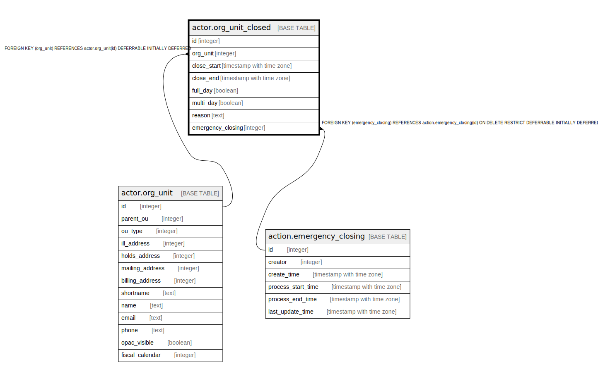

# actor.org_unit_closed

## Description

## Columns

| Name | Type | Default | Nullable | Children | Parents | Comment |
| ---- | ---- | ------- | -------- | -------- | ------- | ------- |
| id | integer | nextval('actor.org_unit_closed_id_seq'::regclass) | false |  |  |  |
| org_unit | integer |  | false |  | [actor.org_unit](actor.org_unit.md) |  |
| close_start | timestamp with time zone |  | false |  |  |  |
| close_end | timestamp with time zone |  | false |  |  |  |
| full_day | boolean | false | false |  |  |  |
| multi_day | boolean | false | false |  |  |  |
| reason | text |  | true |  |  |  |
| emergency_closing | integer |  | true |  | [action.emergency_closing](action.emergency_closing.md) |  |

## Constraints

| Name | Type | Definition |
| ---- | ---- | ---------- |
| org_unit_closed_emergency_closing_fkey | FOREIGN KEY | FOREIGN KEY (emergency_closing) REFERENCES action.emergency_closing(id) ON DELETE RESTRICT DEFERRABLE INITIALLY DEFERRED |
| org_unit_closed_pkey | PRIMARY KEY | PRIMARY KEY (id) |
| org_unit_closed_org_unit_fkey | FOREIGN KEY | FOREIGN KEY (org_unit) REFERENCES actor.org_unit(id) DEFERRABLE INITIALLY DEFERRED |

## Indexes

| Name | Definition |
| ---- | ---------- |
| org_unit_closed_pkey | CREATE UNIQUE INDEX org_unit_closed_pkey ON actor.org_unit_closed USING btree (id) |

## Relations

---

> Generated by [tbls](https://github.com/k1LoW/tbls)
