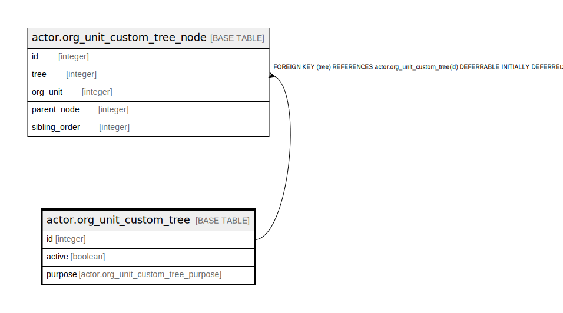

# actor.org_unit_custom_tree

## Description

## Columns

| Name | Type | Default | Nullable | Children | Parents | Comment |
| ---- | ---- | ------- | -------- | -------- | ------- | ------- |
| id | integer | nextval('actor.org_unit_custom_tree_id_seq'::regclass) | false | [actor.org_unit_custom_tree_node](actor.org_unit_custom_tree_node.md) |  |  |
| active | boolean | false | true |  |  |  |
| purpose | actor.org_unit_custom_tree_purpose | 'opac'::actor.org_unit_custom_tree_purpose | false |  |  |  |

## Constraints

| Name | Type | Definition |
| ---- | ---- | ---------- |
| org_unit_custom_tree_pkey | PRIMARY KEY | PRIMARY KEY (id) |
| org_unit_custom_tree_purpose_key | UNIQUE | UNIQUE (purpose) |

## Indexes

| Name | Definition |
| ---- | ---------- |
| org_unit_custom_tree_pkey | CREATE UNIQUE INDEX org_unit_custom_tree_pkey ON actor.org_unit_custom_tree USING btree (id) |
| org_unit_custom_tree_purpose_key | CREATE UNIQUE INDEX org_unit_custom_tree_purpose_key ON actor.org_unit_custom_tree USING btree (purpose) |

## Relations

---

> Generated by [tbls](https://github.com/k1LoW/tbls)
