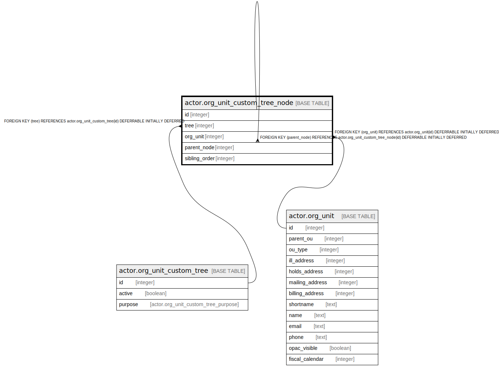

# actor.org_unit_custom_tree_node

## Description

## Columns

| Name | Type | Default | Nullable | Children | Parents | Comment |
| ---- | ---- | ------- | -------- | -------- | ------- | ------- |
| id | integer | nextval('actor.org_unit_custom_tree_node_id_seq'::regclass) | false | [actor.org_unit_custom_tree_node](actor.org_unit_custom_tree_node.md) |  |  |
| tree | integer |  | true |  | [actor.org_unit_custom_tree](actor.org_unit_custom_tree.md) |  |
| org_unit | integer |  | false |  | [actor.org_unit](actor.org_unit.md) |  |
| parent_node | integer |  | true |  | [actor.org_unit_custom_tree_node](actor.org_unit_custom_tree_node.md) |  |
| sibling_order | integer | 0 | false |  |  |  |

## Constraints

| Name | Type | Definition |
| ---- | ---- | ---------- |
| aouctn_once_per_org | UNIQUE | UNIQUE (tree, org_unit) |
| org_unit_custom_tree_node_parent_node_fkey | FOREIGN KEY | FOREIGN KEY (parent_node) REFERENCES actor.org_unit_custom_tree_node(id) DEFERRABLE INITIALLY DEFERRED |
| org_unit_custom_tree_node_pkey | PRIMARY KEY | PRIMARY KEY (id) |
| org_unit_custom_tree_node_tree_fkey | FOREIGN KEY | FOREIGN KEY (tree) REFERENCES actor.org_unit_custom_tree(id) DEFERRABLE INITIALLY DEFERRED |
| org_unit_custom_tree_node_org_unit_fkey | FOREIGN KEY | FOREIGN KEY (org_unit) REFERENCES actor.org_unit(id) DEFERRABLE INITIALLY DEFERRED |

## Indexes

| Name | Definition |
| ---- | ---------- |
| aouctn_once_per_org | CREATE UNIQUE INDEX aouctn_once_per_org ON actor.org_unit_custom_tree_node USING btree (tree, org_unit) |
| org_unit_custom_tree_node_pkey | CREATE UNIQUE INDEX org_unit_custom_tree_node_pkey ON actor.org_unit_custom_tree_node USING btree (id) |

## Relations

---

> Generated by [tbls](https://github.com/k1LoW/tbls)
