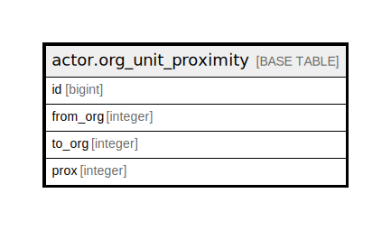

# actor.org_unit_proximity

## Description

## Columns

| Name | Type | Default | Nullable | Children | Parents | Comment |
| ---- | ---- | ------- | -------- | -------- | ------- | ------- |
| id | bigint | nextval('actor.org_unit_proximity_id_seq'::regclass) | false |  |  |  |
| from_org | integer |  | true |  |  |  |
| to_org | integer |  | true |  |  |  |
| prox | integer |  | true |  |  |  |

## Constraints

| Name | Type | Definition |
| ---- | ---- | ---------- |
| org_unit_proximity_pkey | PRIMARY KEY | PRIMARY KEY (id) |

## Indexes

| Name | Definition |
| ---- | ---------- |
| org_unit_proximity_pkey | CREATE UNIQUE INDEX org_unit_proximity_pkey ON actor.org_unit_proximity USING btree (id) |
| from_prox_idx | CREATE INDEX from_prox_idx ON actor.org_unit_proximity USING btree (from_org) |

## Relations

---

> Generated by [tbls](https://github.com/k1LoW/tbls)
