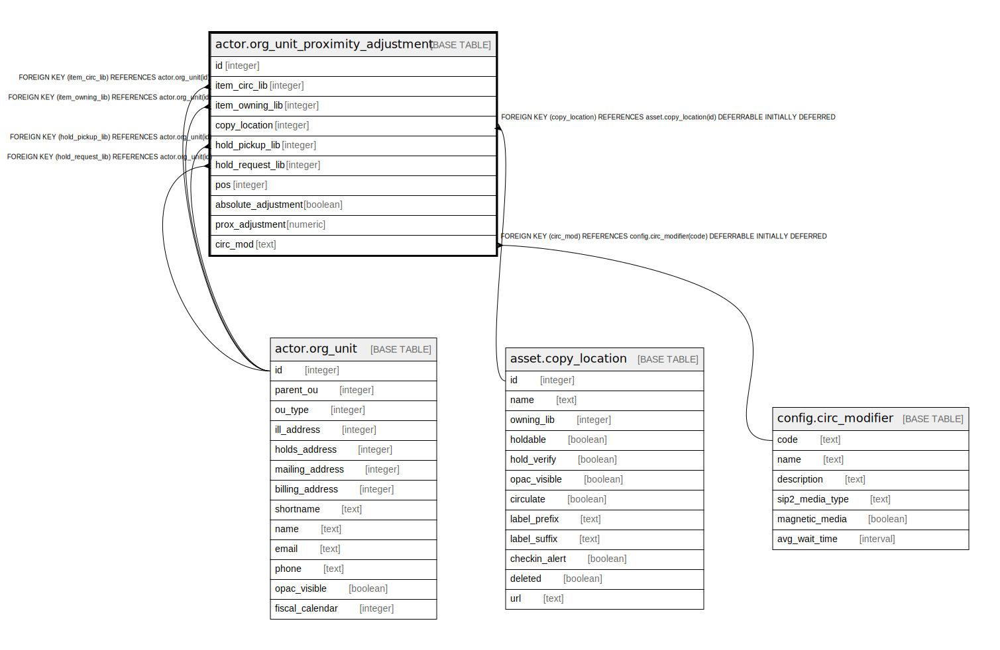

# actor.org_unit_proximity_adjustment

## Description

## Columns

| Name | Type | Default | Nullable | Children | Parents | Comment |
| ---- | ---- | ------- | -------- | -------- | ------- | ------- |
| id | integer | nextval('actor.org_unit_proximity_adjustment_id_seq'::regclass) | false |  |  |  |
| item_circ_lib | integer |  | true |  | [actor.org_unit](actor.org_unit.md) |  |
| item_owning_lib | integer |  | true |  | [actor.org_unit](actor.org_unit.md) |  |
| copy_location | integer |  | true |  | [asset.copy_location](asset.copy_location.md) |  |
| hold_pickup_lib | integer |  | true |  | [actor.org_unit](actor.org_unit.md) |  |
| hold_request_lib | integer |  | true |  | [actor.org_unit](actor.org_unit.md) |  |
| pos | integer | 0 | false |  |  |  |
| absolute_adjustment | boolean | false | false |  |  |  |
| prox_adjustment | numeric |  | true |  |  |  |
| circ_mod | text |  | true |  | [config.circ_modifier](config.circ_modifier.md) |  |

## Constraints

| Name | Type | Definition |
| ---- | ---- | ---------- |
| prox_adj_criterium | CHECK | CHECK ((COALESCE((item_circ_lib)::text, (item_owning_lib)::text, (copy_location)::text, (hold_pickup_lib)::text, (hold_request_lib)::text, circ_mod) IS NOT NULL)) |
| org_unit_proximity_adjustment_hold_pickup_lib_fkey | FOREIGN KEY | FOREIGN KEY (hold_pickup_lib) REFERENCES actor.org_unit(id) |
| org_unit_proximity_adjustment_hold_request_lib_fkey | FOREIGN KEY | FOREIGN KEY (hold_request_lib) REFERENCES actor.org_unit(id) |
| org_unit_proximity_adjustment_item_circ_lib_fkey | FOREIGN KEY | FOREIGN KEY (item_circ_lib) REFERENCES actor.org_unit(id) |
| org_unit_proximity_adjustment_item_owning_lib_fkey | FOREIGN KEY | FOREIGN KEY (item_owning_lib) REFERENCES actor.org_unit(id) |
| org_unit_proximity_adjustment_pkey | PRIMARY KEY | PRIMARY KEY (id) |
| actor_org_unit_proximity_copy_location_fkey | FOREIGN KEY | FOREIGN KEY (copy_location) REFERENCES asset.copy_location(id) DEFERRABLE INITIALLY DEFERRED |
| actor_org_unit_proximity_adjustment_circ_mod_fkey | FOREIGN KEY | FOREIGN KEY (circ_mod) REFERENCES config.circ_modifier(code) DEFERRABLE INITIALLY DEFERRED |

## Indexes

| Name | Definition |
| ---- | ---------- |
| org_unit_proximity_adjustment_pkey | CREATE UNIQUE INDEX org_unit_proximity_adjustment_pkey ON actor.org_unit_proximity_adjustment USING btree (id) |
| prox_adj_circ_lib_idx | CREATE INDEX prox_adj_circ_lib_idx ON actor.org_unit_proximity_adjustment USING btree (item_circ_lib) |
| prox_adj_circ_mod_idx | CREATE INDEX prox_adj_circ_mod_idx ON actor.org_unit_proximity_adjustment USING btree (circ_mod) |
| prox_adj_copy_location_idx | CREATE INDEX prox_adj_copy_location_idx ON actor.org_unit_proximity_adjustment USING btree (copy_location) |
| prox_adj_once_idx | CREATE UNIQUE INDEX prox_adj_once_idx ON actor.org_unit_proximity_adjustment USING btree (COALESCE(item_circ_lib, '-1'::integer), COALESCE(item_owning_lib, '-1'::integer), COALESCE(copy_location, '-1'::integer), COALESCE(hold_pickup_lib, '-1'::integer), COALESCE(hold_request_lib, '-1'::integer), COALESCE(circ_mod, ''::text), pos) |
| prox_adj_owning_lib_idx | CREATE INDEX prox_adj_owning_lib_idx ON actor.org_unit_proximity_adjustment USING btree (item_owning_lib) |
| prox_adj_pickup_lib_idx | CREATE INDEX prox_adj_pickup_lib_idx ON actor.org_unit_proximity_adjustment USING btree (hold_pickup_lib) |
| prox_adj_request_lib_idx | CREATE INDEX prox_adj_request_lib_idx ON actor.org_unit_proximity_adjustment USING btree (hold_request_lib) |

## Relations

---

> Generated by [tbls](https://github.com/k1LoW/tbls)
