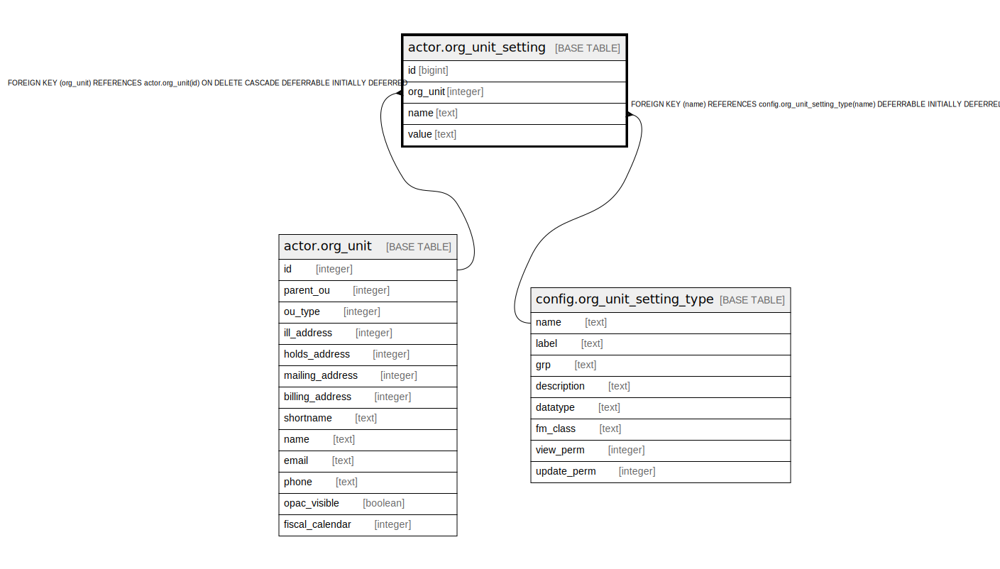

# actor.org_unit_setting

## Description

  
Org Unit settings  
  
This table contains any arbitrary settings that a client  
program would like to save for an org unit.  

## Columns

| Name | Type | Default | Nullable | Children | Parents | Comment |
| ---- | ---- | ------- | -------- | -------- | ------- | ------- |
| id | bigint | nextval('actor.org_unit_setting_id_seq'::regclass) | false |  |  |  |
| org_unit | integer |  | false |  | [actor.org_unit](actor.org_unit.md) |  |
| name | text |  | false |  | [config.org_unit_setting_type](config.org_unit_setting_type.md) |  |
| value | text |  | false |  |  |  |

## Constraints

| Name | Type | Definition |
| ---- | ---- | ---------- |
| aous_must_be_json | CHECK | CHECK (is_json(value)) |
| org_unit_setting_org_unit_fkey | FOREIGN KEY | FOREIGN KEY (org_unit) REFERENCES actor.org_unit(id) ON DELETE CASCADE DEFERRABLE INITIALLY DEFERRED |
| org_unit_setting_pkey | PRIMARY KEY | PRIMARY KEY (id) |
| ou_once_per_key | UNIQUE | UNIQUE (org_unit, name) |
| org_unit_setting_name_fkey | FOREIGN KEY | FOREIGN KEY (name) REFERENCES config.org_unit_setting_type(name) DEFERRABLE INITIALLY DEFERRED |

## Indexes

| Name | Definition |
| ---- | ---------- |
| org_unit_setting_pkey | CREATE UNIQUE INDEX org_unit_setting_pkey ON actor.org_unit_setting USING btree (id) |
| ou_once_per_key | CREATE UNIQUE INDEX ou_once_per_key ON actor.org_unit_setting USING btree (org_unit, name) |
| actor_org_unit_setting_usr_idx | CREATE INDEX actor_org_unit_setting_usr_idx ON actor.org_unit_setting USING btree (org_unit) |

## Triggers

| Name | Definition |
| ---- | ---------- |
| log_ous_change | CREATE TRIGGER log_ous_change BEFORE INSERT OR UPDATE ON actor.org_unit_setting FOR EACH ROW EXECUTE PROCEDURE ous_change_log() |
| log_ous_del | CREATE TRIGGER log_ous_del BEFORE DELETE ON actor.org_unit_setting FOR EACH ROW EXECUTE PROCEDURE ous_delete_log() |

## Relations

---

> Generated by [tbls](https://github.com/k1LoW/tbls)
