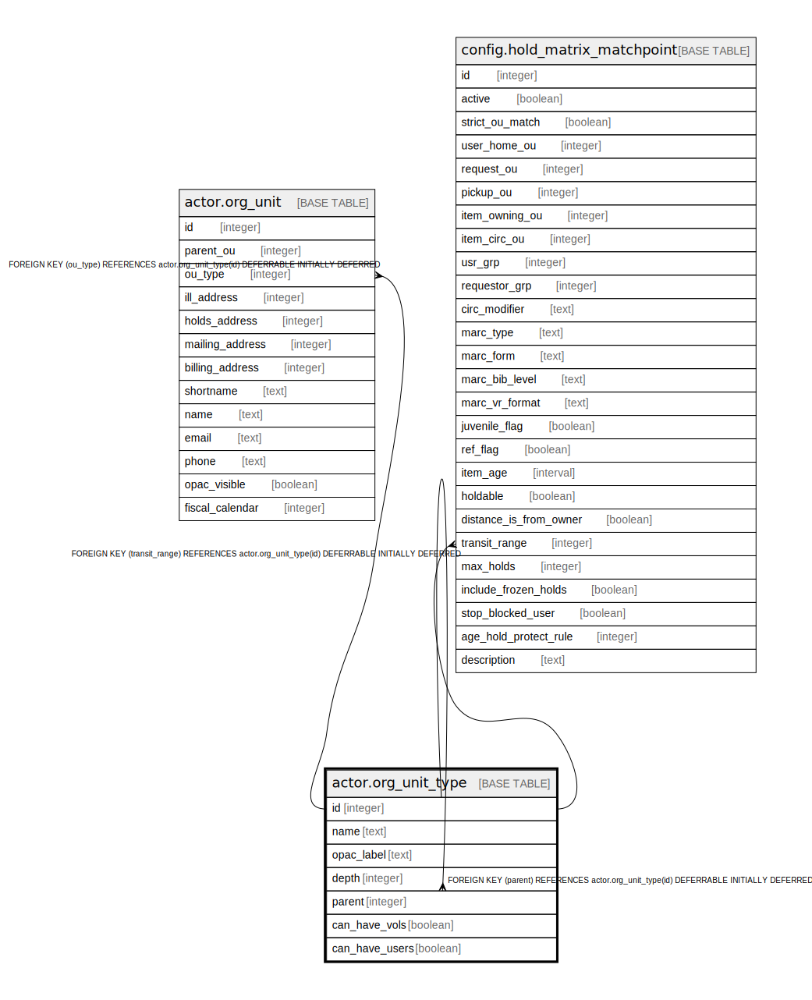

# actor.org_unit_type

## Description

## Columns

| Name | Type | Default | Nullable | Children | Parents | Comment |
| ---- | ---- | ------- | -------- | -------- | ------- | ------- |
| id | integer | nextval('actor.org_unit_type_id_seq'::regclass) | false | [actor.org_unit](actor.org_unit.md) [actor.org_unit_type](actor.org_unit_type.md) [config.hold_matrix_matchpoint](config.hold_matrix_matchpoint.md) |  |  |
| name | text |  | false |  |  |  |
| opac_label | text |  | false |  |  |  |
| depth | integer |  | false |  |  |  |
| parent | integer |  | true |  | [actor.org_unit_type](actor.org_unit_type.md) |  |
| can_have_vols | boolean | true | false |  |  |  |
| can_have_users | boolean | true | false |  |  |  |

## Constraints

| Name | Type | Definition |
| ---- | ---- | ---------- |
| org_unit_type_parent_fkey | FOREIGN KEY | FOREIGN KEY (parent) REFERENCES actor.org_unit_type(id) DEFERRABLE INITIALLY DEFERRED |
| org_unit_type_pkey | PRIMARY KEY | PRIMARY KEY (id) |

## Indexes

| Name | Definition |
| ---- | ---------- |
| org_unit_type_pkey | CREATE UNIQUE INDEX org_unit_type_pkey ON actor.org_unit_type USING btree (id) |
| actor_org_unit_type_parent_idx | CREATE INDEX actor_org_unit_type_parent_idx ON actor.org_unit_type USING btree (parent) |

## Relations

---

> Generated by [tbls](https://github.com/k1LoW/tbls)
