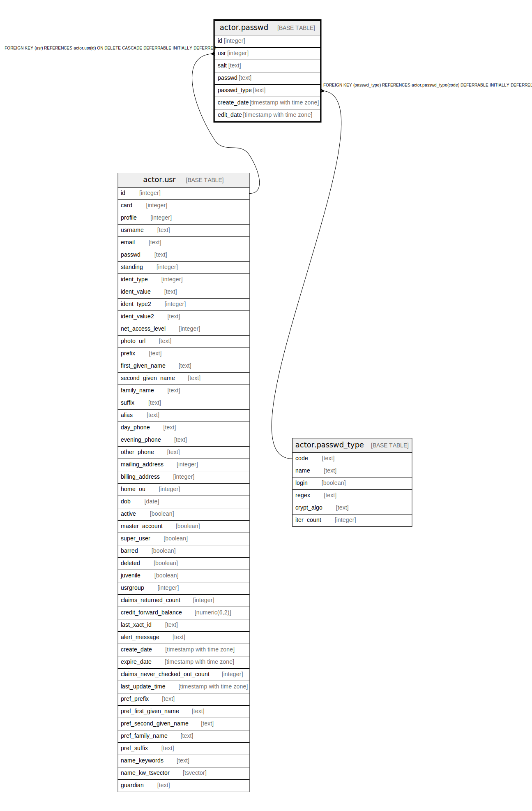

# actor.passwd

## Description

## Columns

| Name | Type | Default | Nullable | Children | Parents | Comment |
| ---- | ---- | ------- | -------- | -------- | ------- | ------- |
| id | integer | nextval('actor.passwd_id_seq'::regclass) | false |  |  |  |
| usr | integer |  | false |  | [actor.usr](actor.usr.md) |  |
| salt | text |  | true |  |  |  |
| passwd | text |  | false |  |  |  |
| passwd_type | text |  | false |  | [actor.passwd_type](actor.passwd_type.md) |  |
| create_date | timestamp with time zone | now() | false |  |  |  |
| edit_date | timestamp with time zone | now() | false |  |  |  |

## Constraints

| Name | Type | Definition |
| ---- | ---- | ---------- |
| passwd_pkey | PRIMARY KEY | PRIMARY KEY (id) |
| passwd_type_once_per_user | UNIQUE | UNIQUE (usr, passwd_type) |
| passwd_passwd_type_fkey | FOREIGN KEY | FOREIGN KEY (passwd_type) REFERENCES actor.passwd_type(code) DEFERRABLE INITIALLY DEFERRED |
| passwd_usr_fkey | FOREIGN KEY | FOREIGN KEY (usr) REFERENCES actor.usr(id) ON DELETE CASCADE DEFERRABLE INITIALLY DEFERRED |

## Indexes

| Name | Definition |
| ---- | ---------- |
| passwd_pkey | CREATE UNIQUE INDEX passwd_pkey ON actor.passwd USING btree (id) |
| passwd_type_once_per_user | CREATE UNIQUE INDEX passwd_type_once_per_user ON actor.passwd USING btree (usr, passwd_type) |

## Relations

---

> Generated by [tbls](https://github.com/k1LoW/tbls)
