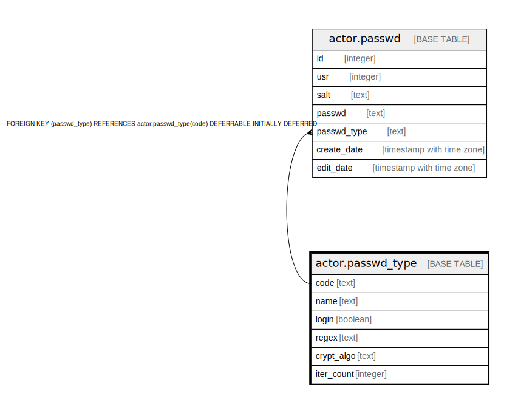

# actor.passwd_type

## Description

## Columns

| Name | Type | Default | Nullable | Children | Parents | Comment |
| ---- | ---- | ------- | -------- | -------- | ------- | ------- |
| code | text |  | false | [actor.passwd](actor.passwd.md) |  |  |
| name | text |  | false |  |  |  |
| login | boolean | false | false |  |  |  |
| regex | text |  | true |  |  |  |
| crypt_algo | text |  | true |  |  |  |
| iter_count | integer |  | true |  |  |  |

## Constraints

| Name | Type | Definition |
| ---- | ---- | ---------- |
| passwd_type_iter_count_check | CHECK | CHECK (((iter_count IS NULL) OR (iter_count > 0))) |
| passwd_type_name_key | UNIQUE | UNIQUE (name) |
| passwd_type_pkey | PRIMARY KEY | PRIMARY KEY (code) |

## Indexes

| Name | Definition |
| ---- | ---------- |
| passwd_type_name_key | CREATE UNIQUE INDEX passwd_type_name_key ON actor.passwd_type USING btree (name) |
| passwd_type_pkey | CREATE UNIQUE INDEX passwd_type_pkey ON actor.passwd_type USING btree (code) |

## Relations

---

> Generated by [tbls](https://github.com/k1LoW/tbls)
