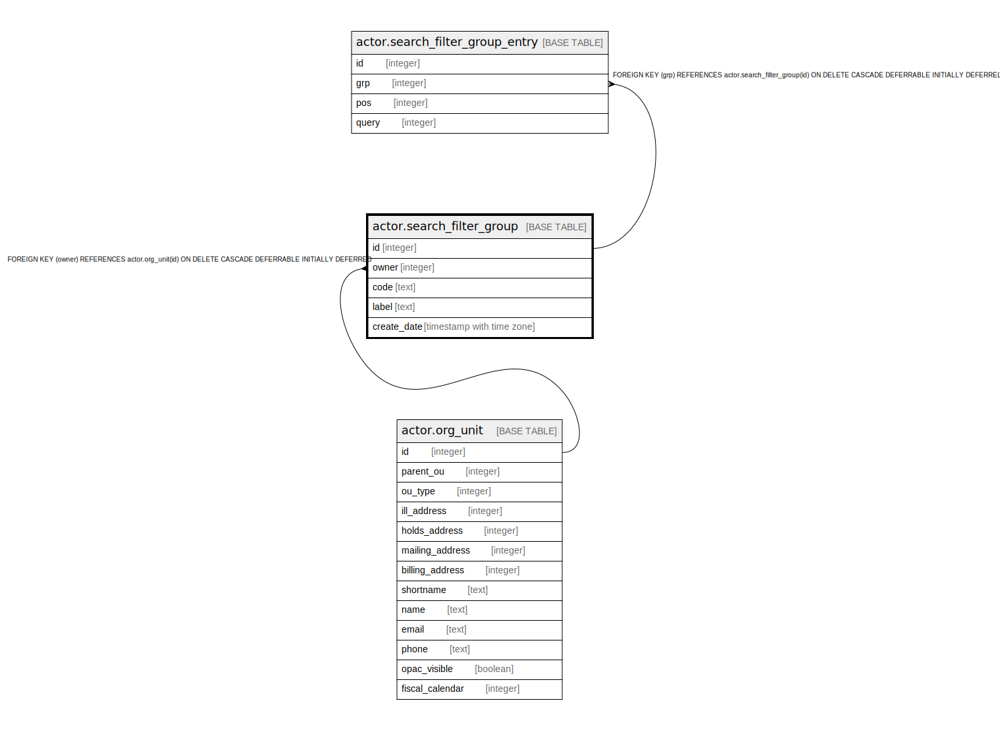

# actor.search_filter_group

## Description

## Columns

| Name | Type | Default | Nullable | Children | Parents | Comment |
| ---- | ---- | ------- | -------- | -------- | ------- | ------- |
| id | integer | nextval('actor.search_filter_group_id_seq'::regclass) | false | [actor.search_filter_group_entry](actor.search_filter_group_entry.md) |  |  |
| owner | integer |  | false |  | [actor.org_unit](actor.org_unit.md) |  |
| code | text |  | false |  |  |  |
| label | text |  | false |  |  |  |
| create_date | timestamp with time zone | now() | false |  |  |  |

## Constraints

| Name | Type | Definition |
| ---- | ---- | ---------- |
| asfg_code_once_per_org | UNIQUE | UNIQUE (owner, code) |
| asfg_label_once_per_org | UNIQUE | UNIQUE (owner, label) |
| search_filter_group_owner_fkey | FOREIGN KEY | FOREIGN KEY (owner) REFERENCES actor.org_unit(id) ON DELETE CASCADE DEFERRABLE INITIALLY DEFERRED |
| search_filter_group_pkey | PRIMARY KEY | PRIMARY KEY (id) |

## Indexes

| Name | Definition |
| ---- | ---------- |
| asfg_code_once_per_org | CREATE UNIQUE INDEX asfg_code_once_per_org ON actor.search_filter_group USING btree (owner, code) |
| asfg_label_once_per_org | CREATE UNIQUE INDEX asfg_label_once_per_org ON actor.search_filter_group USING btree (owner, label) |
| search_filter_group_pkey | CREATE UNIQUE INDEX search_filter_group_pkey ON actor.search_filter_group USING btree (id) |

## Relations

---

> Generated by [tbls](https://github.com/k1LoW/tbls)
