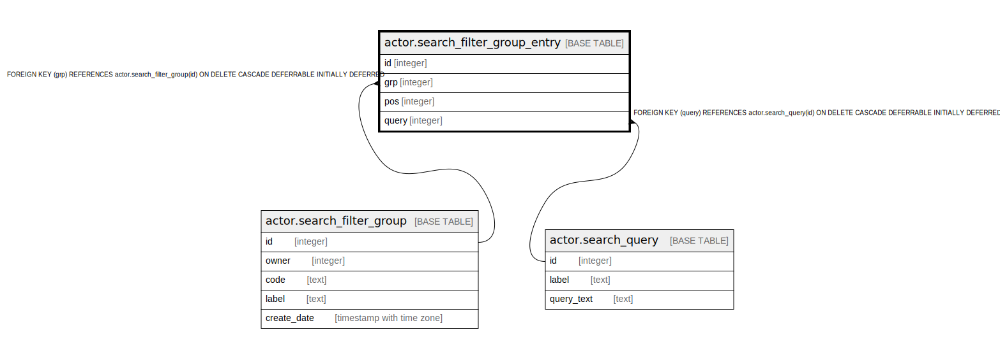

# actor.search_filter_group_entry

## Description

## Columns

| Name | Type | Default | Nullable | Children | Parents | Comment |
| ---- | ---- | ------- | -------- | -------- | ------- | ------- |
| id | integer | nextval('actor.search_filter_group_entry_id_seq'::regclass) | false |  |  |  |
| grp | integer |  | false |  | [actor.search_filter_group](actor.search_filter_group.md) |  |
| pos | integer | 0 | false |  |  |  |
| query | integer |  | false |  | [actor.search_query](actor.search_query.md) |  |

## Constraints

| Name | Type | Definition |
| ---- | ---- | ---------- |
| asfge_query_once_per_group | UNIQUE | UNIQUE (grp, query) |
| search_filter_group_entry_pkey | PRIMARY KEY | PRIMARY KEY (id) |
| search_filter_group_entry_grp_fkey | FOREIGN KEY | FOREIGN KEY (grp) REFERENCES actor.search_filter_group(id) ON DELETE CASCADE DEFERRABLE INITIALLY DEFERRED |
| search_filter_group_entry_query_fkey | FOREIGN KEY | FOREIGN KEY (query) REFERENCES actor.search_query(id) ON DELETE CASCADE DEFERRABLE INITIALLY DEFERRED |

## Indexes

| Name | Definition |
| ---- | ---------- |
| asfge_query_once_per_group | CREATE UNIQUE INDEX asfge_query_once_per_group ON actor.search_filter_group_entry USING btree (grp, query) |
| search_filter_group_entry_pkey | CREATE UNIQUE INDEX search_filter_group_entry_pkey ON actor.search_filter_group_entry USING btree (id) |

## Relations

---

> Generated by [tbls](https://github.com/k1LoW/tbls)
