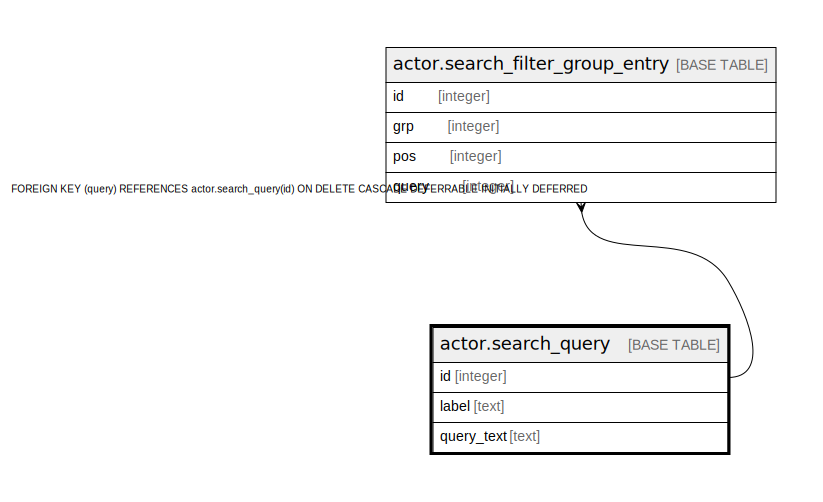

# actor.search_query

## Description

## Columns

| Name | Type | Default | Nullable | Children | Parents | Comment |
| ---- | ---- | ------- | -------- | -------- | ------- | ------- |
| id | integer | nextval('actor.search_query_id_seq'::regclass) | false | [actor.search_filter_group_entry](actor.search_filter_group_entry.md) |  |  |
| label | text |  | false |  |  |  |
| query_text | text |  | false |  |  |  |

## Constraints

| Name | Type | Definition |
| ---- | ---- | ---------- |
| search_query_pkey | PRIMARY KEY | PRIMARY KEY (id) |

## Indexes

| Name | Definition |
| ---- | ---------- |
| search_query_pkey | CREATE UNIQUE INDEX search_query_pkey ON actor.search_query USING btree (id) |

## Relations

---

> Generated by [tbls](https://github.com/k1LoW/tbls)
