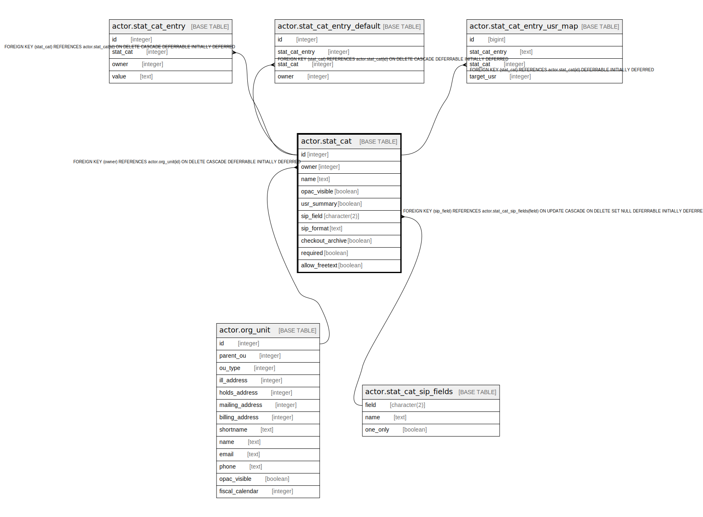

# actor.stat_cat

## Description

  
User Statistical Catagories  
  
Local data collected about Users is placed into a Statistical  
Catagory.  Here's where those catagories are defined.  

## Columns

| Name | Type | Default | Nullable | Children | Parents | Comment |
| ---- | ---- | ------- | -------- | -------- | ------- | ------- |
| id | integer | nextval('actor.stat_cat_id_seq'::regclass) | false | [actor.stat_cat_entry](actor.stat_cat_entry.md) [actor.stat_cat_entry_default](actor.stat_cat_entry_default.md) [actor.stat_cat_entry_usr_map](actor.stat_cat_entry_usr_map.md) |  |  |
| owner | integer |  | false |  | [actor.org_unit](actor.org_unit.md) |  |
| name | text |  | false |  |  |  |
| opac_visible | boolean | false | false |  |  |  |
| usr_summary | boolean | false | false |  |  |  |
| sip_field | character(2) |  | true |  | [actor.stat_cat_sip_fields](actor.stat_cat_sip_fields.md) |  |
| sip_format | text |  | true |  |  |  |
| checkout_archive | boolean | false | false |  |  |  |
| required | boolean | false | false |  |  |  |
| allow_freetext | boolean | true | false |  |  |  |

## Constraints

| Name | Type | Definition |
| ---- | ---- | ---------- |
| actor_stat_cat_owner_fkey | FOREIGN KEY | FOREIGN KEY (owner) REFERENCES actor.org_unit(id) ON DELETE CASCADE DEFERRABLE INITIALLY DEFERRED |
| sc_once_per_owner | UNIQUE | UNIQUE (owner, name) |
| stat_cat_pkey | PRIMARY KEY | PRIMARY KEY (id) |
| stat_cat_sip_field_fkey | FOREIGN KEY | FOREIGN KEY (sip_field) REFERENCES actor.stat_cat_sip_fields(field) ON UPDATE CASCADE ON DELETE SET NULL DEFERRABLE INITIALLY DEFERRED |

## Indexes

| Name | Definition |
| ---- | ---------- |
| sc_once_per_owner | CREATE UNIQUE INDEX sc_once_per_owner ON actor.stat_cat USING btree (owner, name) |
| stat_cat_pkey | CREATE UNIQUE INDEX stat_cat_pkey ON actor.stat_cat USING btree (id) |

## Triggers

| Name | Definition |
| ---- | ---------- |
| actor_stat_cat_sip_update_trigger | CREATE TRIGGER actor_stat_cat_sip_update_trigger BEFORE INSERT OR UPDATE ON actor.stat_cat FOR EACH ROW EXECUTE PROCEDURE actor.stat_cat_check() |

## Relations

---

> Generated by [tbls](https://github.com/k1LoW/tbls)
