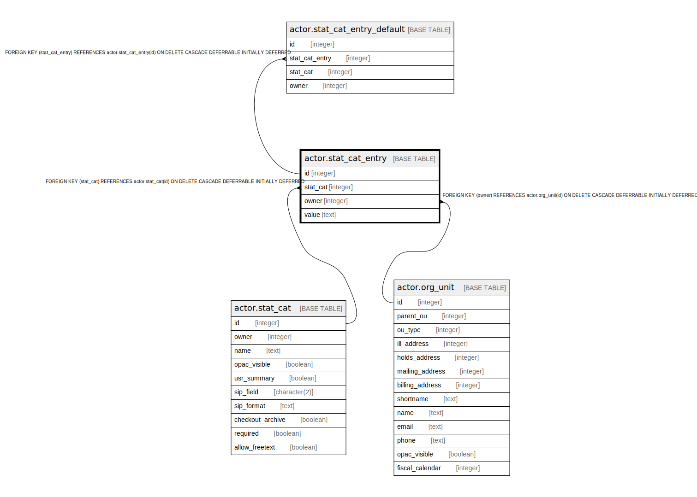

# actor.stat_cat_entry

## Description

  
User Statistical Catagory Entries  
  
Local data collected about Users is placed into a Statistical  
Catagory.  Each library can create entries into any of its own  
stat_cats, its ancestors' stat_cats, or its descendants' stat_cats.  

## Columns

| Name | Type | Default | Nullable | Children | Parents | Comment |
| ---- | ---- | ------- | -------- | -------- | ------- | ------- |
| id | integer | nextval('actor.stat_cat_entry_id_seq'::regclass) | false | [actor.stat_cat_entry_default](actor.stat_cat_entry_default.md) |  |  |
| stat_cat | integer |  | false |  | [actor.stat_cat](actor.stat_cat.md) |  |
| owner | integer |  | false |  | [actor.org_unit](actor.org_unit.md) |  |
| value | text |  | false |  |  |  |

## Constraints

| Name | Type | Definition |
| ---- | ---- | ---------- |
| actor_stat_cat_entry_owner_fkey | FOREIGN KEY | FOREIGN KEY (owner) REFERENCES actor.org_unit(id) ON DELETE CASCADE DEFERRABLE INITIALLY DEFERRED |
| sce_once_per_owner | UNIQUE | UNIQUE (stat_cat, owner, value) |
| stat_cat_entry_pkey | PRIMARY KEY | PRIMARY KEY (id) |
| actor_stat_cat_entry_stat_cat_fkey | FOREIGN KEY | FOREIGN KEY (stat_cat) REFERENCES actor.stat_cat(id) ON DELETE CASCADE DEFERRABLE INITIALLY DEFERRED |

## Indexes

| Name | Definition |
| ---- | ---------- |
| sce_once_per_owner | CREATE UNIQUE INDEX sce_once_per_owner ON actor.stat_cat_entry USING btree (stat_cat, owner, value) |
| stat_cat_entry_pkey | CREATE UNIQUE INDEX stat_cat_entry_pkey ON actor.stat_cat_entry USING btree (id) |

## Relations

---

> Generated by [tbls](https://github.com/k1LoW/tbls)
