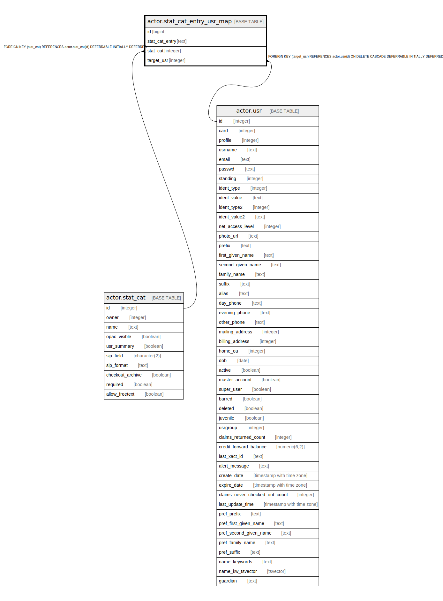

# actor.stat_cat_entry_usr_map

## Description

  
Statistical Catagory Entry to User map  
  
Records the stat_cat entries for each user.  

## Columns

| Name | Type | Default | Nullable | Children | Parents | Comment |
| ---- | ---- | ------- | -------- | -------- | ------- | ------- |
| id | bigint | nextval('actor.stat_cat_entry_usr_map_id_seq'::regclass) | false |  |  |  |
| stat_cat_entry | text |  | false |  |  |  |
| stat_cat | integer |  | false |  | [actor.stat_cat](actor.stat_cat.md) |  |
| target_usr | integer |  | false |  | [actor.usr](actor.usr.md) |  |

## Constraints

| Name | Type | Definition |
| ---- | ---- | ---------- |
| sc_once_per_usr | UNIQUE | UNIQUE (target_usr, stat_cat) |
| stat_cat_entry_usr_map_pkey | PRIMARY KEY | PRIMARY KEY (id) |
| actor_sceum_sc_fkey | FOREIGN KEY | FOREIGN KEY (stat_cat) REFERENCES actor.stat_cat(id) DEFERRABLE INITIALLY DEFERRED |
| actor_sceum_tu_fkey | FOREIGN KEY | FOREIGN KEY (target_usr) REFERENCES actor.usr(id) ON DELETE CASCADE DEFERRABLE INITIALLY DEFERRED |

## Indexes

| Name | Definition |
| ---- | ---------- |
| sc_once_per_usr | CREATE UNIQUE INDEX sc_once_per_usr ON actor.stat_cat_entry_usr_map USING btree (target_usr, stat_cat) |
| stat_cat_entry_usr_map_pkey | CREATE UNIQUE INDEX stat_cat_entry_usr_map_pkey ON actor.stat_cat_entry_usr_map USING btree (id) |
| actor_stat_cat_entry_usr_idx | CREATE INDEX actor_stat_cat_entry_usr_idx ON actor.stat_cat_entry_usr_map USING btree (target_usr) |

## Relations

---

> Generated by [tbls](https://github.com/k1LoW/tbls)
