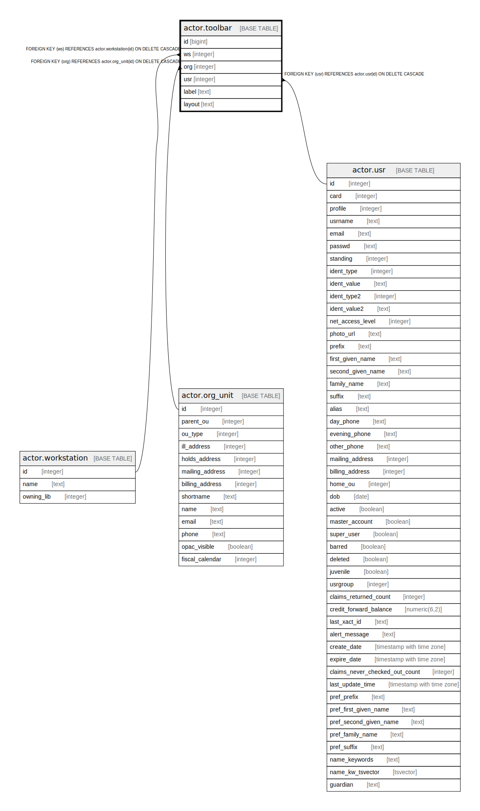

# actor.toolbar

## Description

## Columns

| Name | Type | Default | Nullable | Children | Parents | Comment |
| ---- | ---- | ------- | -------- | -------- | ------- | ------- |
| id | bigint | nextval('actor.toolbar_id_seq'::regclass) | false |  |  |  |
| ws | integer |  | true |  | [actor.workstation](actor.workstation.md) |  |
| org | integer |  | true |  | [actor.org_unit](actor.org_unit.md) |  |
| usr | integer |  | true |  | [actor.usr](actor.usr.md) |  |
| label | text |  | false |  |  |  |
| layout | text |  | false |  |  |  |

## Constraints

| Name | Type | Definition |
| ---- | ---- | ---------- |
| layout_must_be_json | CHECK | CHECK (is_json(layout)) |
| only_one_type | CHECK | CHECK ((((ws IS NOT NULL) AND (COALESCE(org, usr) IS NULL)) OR ((org IS NOT NULL) AND (COALESCE(ws, usr) IS NULL)) OR ((usr IS NOT NULL) AND (COALESCE(org, ws) IS NULL)))) |
| toolbar_org_fkey | FOREIGN KEY | FOREIGN KEY (org) REFERENCES actor.org_unit(id) ON DELETE CASCADE |
| toolbar_pkey | PRIMARY KEY | PRIMARY KEY (id) |
| toolbar_usr_fkey | FOREIGN KEY | FOREIGN KEY (usr) REFERENCES actor.usr(id) ON DELETE CASCADE |
| toolbar_ws_fkey | FOREIGN KEY | FOREIGN KEY (ws) REFERENCES actor.workstation(id) ON DELETE CASCADE |

## Indexes

| Name | Definition |
| ---- | ---------- |
| toolbar_pkey | CREATE UNIQUE INDEX toolbar_pkey ON actor.toolbar USING btree (id) |
| label_once_per_org | CREATE UNIQUE INDEX label_once_per_org ON actor.toolbar USING btree (org, label) WHERE (org IS NOT NULL) |
| label_once_per_usr | CREATE UNIQUE INDEX label_once_per_usr ON actor.toolbar USING btree (usr, label) WHERE (usr IS NOT NULL) |
| label_once_per_ws | CREATE UNIQUE INDEX label_once_per_ws ON actor.toolbar USING btree (ws, label) WHERE (ws IS NOT NULL) |

## Relations

---

> Generated by [tbls](https://github.com/k1LoW/tbls)
