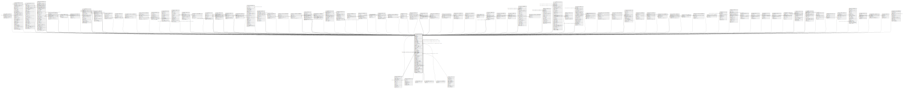

# actor.usr

## Description

  
User objects  
  
This table contains the core User objects that describe both  
staff members and patrons.  The difference between the two  
types of users is based on the user's permissions.  

## Columns

| Name | Type | Default | Nullable | Children | Parents | Comment |
| ---- | ---- | ------- | -------- | -------- | ------- | ------- |
| id | integer | nextval('actor.usr_id_seq'::regclass) | false | [money.billable_xact](money.billable_xact.md) [action.circulation](action.circulation.md) [asset.copy](asset.copy.md) [action.hold_request](action.hold_request.md) [actor.usr_standing_penalty](actor.usr_standing_penalty.md) [actor.usr_activity](actor.usr_activity.md) [permission.usr_perm_map](permission.usr_perm_map.md) [acq.lineitem](acq.lineitem.md) [acq.purchase_order](acq.purchase_order.md) [acq.fund_allocation](acq.fund_allocation.md) [acq.claim_event](acq.claim_event.md) [acq.distribution_formula_application](acq.distribution_formula_application.md) [acq.fund_allocation_percent](acq.fund_allocation_percent.md) [acq.fund_transfer](acq.fund_transfer.md) [acq.invoice](acq.invoice.md) [acq.lineitem_detail](acq.lineitem_detail.md) [acq.lineitem_note](acq.lineitem_note.md) [acq.lineitem_usr_attr_definition](acq.lineitem_usr_attr_definition.md) [acq.picklist](acq.picklist.md) [acq.po_note](acq.po_note.md) [acq.provider_note](acq.provider_note.md) [acq.serial_claim_event](acq.serial_claim_event.md) [acq.user_request](acq.user_request.md) [actor.usr_address](actor.usr_address.md) [asset.call_number](asset.call_number.md) [action.in_house_use](action.in_house_use.md) [action.non_cat_in_house_use](action.non_cat_in_house_use.md) [action.non_cataloged_circulation](action.non_cataloged_circulation.md) [action.curbside](action.curbside.md) [action.emergency_closing](action.emergency_closing.md) [action.fieldset](action.fieldset.md) [action.fieldset_group](action.fieldset_group.md) [action.hold_notification](action.hold_notification.md) [action.usr_circ_history](action.usr_circ_history.md) [actor.card](actor.card.md) [actor.passwd](actor.passwd.md) [actor.stat_cat_entry_usr_map](actor.stat_cat_entry_usr_map.md) [actor.toolbar](actor.toolbar.md) [actor.usr_message](actor.usr_message.md) [actor.usr_note](actor.usr_note.md) [actor.usr_org_unit_opt_in](actor.usr_org_unit_opt_in.md) [actor.usr_password_reset](actor.usr_password_reset.md) [actor.usr_privacy_waiver](actor.usr_privacy_waiver.md) [actor.usr_saved_search](actor.usr_saved_search.md) [actor.usr_setting](actor.usr_setting.md) [asset.copy_alert](asset.copy_alert.md) [asset.call_number_note](asset.call_number_note.md) [asset.copy_note](asset.copy_note.md) [asset.copy_template](asset.copy_template.md) [asset.course_module_course_users](asset.course_module_course_users.md) [biblio.record_entry](biblio.record_entry.md) [serial.unit](serial.unit.md) [biblio.record_note](biblio.record_note.md) [booking.reservation](booking.reservation.md) [config.filter_dialog_filter_set](config.filter_dialog_filter_set.md) [container.biblio_record_entry_bucket](container.biblio_record_entry_bucket.md) [container.call_number_bucket](container.call_number_bucket.md) [container.carousel](container.carousel.md) [container.copy_bucket](container.copy_bucket.md) [container.user_bucket](container.user_bucket.md) [container.user_bucket_item](container.user_bucket_item.md) [money.collections_tracker](money.collections_tracker.md) [permission.usr_grp_map](permission.usr_grp_map.md) [permission.usr_object_perm_map](permission.usr_object_perm_map.md) [permission.usr_work_ou_map](permission.usr_work_ou_map.md) [reporter.report](reporter.report.md) [reporter.schedule](reporter.schedule.md) [reporter.output_folder](reporter.output_folder.md) [reporter.report_folder](reporter.report_folder.md) [reporter.template](reporter.template.md) [reporter.template_folder](reporter.template_folder.md) [serial.distribution_note](serial.distribution_note.md) [serial.issuance](serial.issuance.md) [serial.item](serial.item.md) [serial.item_note](serial.item_note.md) [serial.routing_list_user](serial.routing_list_user.md) [serial.subscription_note](serial.subscription_note.md) [staging.user_stage](staging.user_stage.md) [url_verify.session](url_verify.session.md) [url_verify.verification_attempt](url_verify.verification_attempt.md) [vandelay.queue](vandelay.queue.md) [vandelay.session_tracker](vandelay.session_tracker.md) |  |  |
| card | integer |  | true |  |  |  |
| profile | integer |  | false |  | [permission.grp_tree](permission.grp_tree.md) |  |
| usrname | text |  | false |  |  |  |
| email | text |  | true |  |  |  |
| passwd | text |  | false |  |  |  |
| standing | integer | 1 | false |  | [config.standing](config.standing.md) |  |
| ident_type | integer |  | false |  | [config.identification_type](config.identification_type.md) |  |
| ident_value | text |  | true |  |  |  |
| ident_type2 | integer |  | true |  | [config.identification_type](config.identification_type.md) |  |
| ident_value2 | text |  | true |  |  |  |
| net_access_level | integer | 1 | false |  | [config.net_access_level](config.net_access_level.md) |  |
| photo_url | text |  | true |  |  |  |
| prefix | text |  | true |  |  |  |
| first_given_name | text |  | false |  |  |  |
| second_given_name | text |  | true |  |  |  |
| family_name | text |  | false |  |  |  |
| suffix | text |  | true |  |  |  |
| alias | text |  | true |  |  |  |
| day_phone | text |  | true |  |  |  |
| evening_phone | text |  | true |  |  |  |
| other_phone | text |  | true |  |  |  |
| mailing_address | integer |  | true |  | [actor.usr_address](actor.usr_address.md) |  |
| billing_address | integer |  | true |  | [actor.usr_address](actor.usr_address.md) |  |
| home_ou | integer |  | false |  | [actor.org_unit](actor.org_unit.md) |  |
| dob | date |  | true |  |  |  |
| active | boolean | true | false |  |  |  |
| master_account | boolean | false | false |  |  |  |
| super_user | boolean | false | false |  |  |  |
| barred | boolean | false | false |  |  |  |
| deleted | boolean | false | false |  |  |  |
| juvenile | boolean | false | false |  |  |  |
| usrgroup | integer | nextval('actor.usr_usrgroup_seq'::regclass) | false |  |  |  |
| claims_returned_count | integer | 0 | false |  |  |  |
| credit_forward_balance | numeric(6,2) | 0.00 | false |  |  |  |
| last_xact_id | text | 'none'::text | false |  |  |  |
| alert_message | text |  | true |  |  |  |
| create_date | timestamp with time zone | now() | false |  |  |  |
| expire_date | timestamp with time zone | (now() + '3 years'::interval) | false |  |  |  |
| claims_never_checked_out_count | integer | 0 | false |  |  |  |
| last_update_time | timestamp with time zone |  | true |  |  |  |
| pref_prefix | text |  | true |  |  |  |
| pref_first_given_name | text |  | true |  |  |  |
| pref_second_given_name | text |  | true |  |  |  |
| pref_family_name | text |  | true |  |  |  |
| pref_suffix | text |  | true |  |  |  |
| name_keywords | text |  | true |  |  |  |
| name_kw_tsvector | tsvector |  | true |  |  |  |
| guardian | text |  | true |  |  |  |

## Constraints

| Name | Type | Definition |
| ---- | ---- | ---------- |
| actor_usr_home_ou_fkey | FOREIGN KEY | FOREIGN KEY (home_ou) REFERENCES actor.org_unit(id) DEFERRABLE INITIALLY DEFERRED |
| actor_usr_billing_address_fkey | FOREIGN KEY | FOREIGN KEY (billing_address) REFERENCES actor.usr_address(id) DEFERRABLE INITIALLY DEFERRED |
| actor_usr_mailing_address_fkey | FOREIGN KEY | FOREIGN KEY (mailing_address) REFERENCES actor.usr_address(id) DEFERRABLE INITIALLY DEFERRED |
| usr_card_key | UNIQUE | UNIQUE (card) |
| usr_pkey | PRIMARY KEY | PRIMARY KEY (id) |
| usr_usrname_key | UNIQUE | UNIQUE (usrname) |
| usr_ident_type2_fkey | FOREIGN KEY | FOREIGN KEY (ident_type2) REFERENCES config.identification_type(id) DEFERRABLE INITIALLY DEFERRED |
| usr_ident_type_fkey | FOREIGN KEY | FOREIGN KEY (ident_type) REFERENCES config.identification_type(id) DEFERRABLE INITIALLY DEFERRED |
| usr_net_access_level_fkey | FOREIGN KEY | FOREIGN KEY (net_access_level) REFERENCES config.net_access_level(id) DEFERRABLE INITIALLY DEFERRED |
| usr_standing_fkey | FOREIGN KEY | FOREIGN KEY (standing) REFERENCES config.standing(id) DEFERRABLE INITIALLY DEFERRED |
| actor_usr_profile_fkey | FOREIGN KEY | FOREIGN KEY (profile) REFERENCES permission.grp_tree(id) DEFERRABLE INITIALLY DEFERRED |

## Indexes

| Name | Definition |
| ---- | ---------- |
| usr_card_key | CREATE UNIQUE INDEX usr_card_key ON actor.usr USING btree (card) |
| usr_pkey | CREATE UNIQUE INDEX usr_pkey ON actor.usr USING btree (id) |
| usr_usrname_key | CREATE UNIQUE INDEX usr_usrname_key ON actor.usr USING btree (usrname) |
| actor_usr_billing_address_idx | CREATE INDEX actor_usr_billing_address_idx ON actor.usr USING btree (billing_address) |
| actor_usr_day_phone_idx | CREATE INDEX actor_usr_day_phone_idx ON actor.usr USING btree (lowercase(day_phone)) |
| actor_usr_day_phone_idx_numeric | CREATE INDEX actor_usr_day_phone_idx_numeric ON actor.usr USING btree (lowercase(regexp_replace(day_phone, '[^0-9]'::text, ''::text, 'g'::text))) |
| actor_usr_email_idx | CREATE INDEX actor_usr_email_idx ON actor.usr USING btree (lowercase(email)) |
| actor_usr_evening_phone_idx | CREATE INDEX actor_usr_evening_phone_idx ON actor.usr USING btree (lowercase(evening_phone)) |
| actor_usr_evening_phone_idx_numeric | CREATE INDEX actor_usr_evening_phone_idx_numeric ON actor.usr USING btree (lowercase(regexp_replace(evening_phone, '[^0-9]'::text, ''::text, 'g'::text))) |
| actor_usr_family_name_idx | CREATE INDEX actor_usr_family_name_idx ON actor.usr USING btree (lowercase(family_name)) |
| actor_usr_family_name_unaccent_idx | CREATE INDEX actor_usr_family_name_unaccent_idx ON actor.usr USING btree (unaccent_and_squash(family_name)) |
| actor_usr_first_given_name_idx | CREATE INDEX actor_usr_first_given_name_idx ON actor.usr USING btree (lowercase(first_given_name)) |
| actor_usr_first_given_name_unaccent_idx | CREATE INDEX actor_usr_first_given_name_unaccent_idx ON actor.usr USING btree (unaccent_and_squash(first_given_name)) |
| actor_usr_guardian_idx | CREATE INDEX actor_usr_guardian_idx ON actor.usr USING btree (lowercase(guardian)) |
| actor_usr_guardian_unaccent_idx | CREATE INDEX actor_usr_guardian_unaccent_idx ON actor.usr USING btree (unaccent_and_squash(guardian)) |
| actor_usr_home_ou_idx | CREATE INDEX actor_usr_home_ou_idx ON actor.usr USING btree (home_ou) |
| actor_usr_ident_value2_idx | CREATE INDEX actor_usr_ident_value2_idx ON actor.usr USING btree (lowercase(ident_value2)) |
| actor_usr_ident_value_idx | CREATE INDEX actor_usr_ident_value_idx ON actor.usr USING btree (lowercase(ident_value)) |
| actor_usr_mailing_address_idx | CREATE INDEX actor_usr_mailing_address_idx ON actor.usr USING btree (mailing_address) |
| actor_usr_other_phone_idx | CREATE INDEX actor_usr_other_phone_idx ON actor.usr USING btree (lowercase(other_phone)) |
| actor_usr_other_phone_idx_numeric | CREATE INDEX actor_usr_other_phone_idx_numeric ON actor.usr USING btree (lowercase(regexp_replace(other_phone, '[^0-9]'::text, ''::text, 'g'::text))) |
| actor_usr_pref_family_name_idx | CREATE INDEX actor_usr_pref_family_name_idx ON actor.usr USING btree (lowercase(pref_family_name)) |
| actor_usr_pref_family_name_unaccent_idx | CREATE INDEX actor_usr_pref_family_name_unaccent_idx ON actor.usr USING btree (unaccent_and_squash(pref_family_name)) |
| actor_usr_pref_first_given_name_idx | CREATE INDEX actor_usr_pref_first_given_name_idx ON actor.usr USING btree (lowercase(pref_first_given_name)) |
| actor_usr_pref_first_given_name_unaccent_idx | CREATE INDEX actor_usr_pref_first_given_name_unaccent_idx ON actor.usr USING btree (unaccent_and_squash(pref_first_given_name)) |
| actor_usr_pref_second_given_name_idx | CREATE INDEX actor_usr_pref_second_given_name_idx ON actor.usr USING btree (lowercase(pref_second_given_name)) |
| actor_usr_pref_second_given_name_unaccent_idx | CREATE INDEX actor_usr_pref_second_given_name_unaccent_idx ON actor.usr USING btree (unaccent_and_squash(pref_second_given_name)) |
| actor_usr_second_given_name_idx | CREATE INDEX actor_usr_second_given_name_idx ON actor.usr USING btree (lowercase(second_given_name)) |
| actor_usr_second_given_name_unaccent_idx | CREATE INDEX actor_usr_second_given_name_unaccent_idx ON actor.usr USING btree (unaccent_and_squash(second_given_name)) |
| actor_usr_usrgroup_idx | CREATE INDEX actor_usr_usrgroup_idx ON actor.usr USING btree (usrgroup) |
| actor_usr_usrname_idx | CREATE INDEX actor_usr_usrname_idx ON actor.usr USING btree (lowercase(usrname)) |
| actor_usr_usrname_unaccent_idx | CREATE INDEX actor_usr_usrname_unaccent_idx ON actor.usr USING btree (unaccent_and_squash(usrname)) |

## Triggers

| Name | Definition |
| ---- | ---------- |
| actor_crypt_pw_insert_trigger | CREATE TRIGGER actor_crypt_pw_insert_trigger BEFORE INSERT ON actor.usr FOR EACH ROW EXECUTE PROCEDURE actor.crypt_pw_insert() |
| actor_crypt_pw_update_trigger | CREATE TRIGGER actor_crypt_pw_update_trigger BEFORE UPDATE ON actor.usr FOR EACH ROW EXECUTE PROCEDURE actor.crypt_pw_update() |
| au_update_trig | CREATE TRIGGER au_update_trig BEFORE INSERT OR UPDATE ON actor.usr FOR EACH ROW EXECUTE PROCEDURE actor.au_updated() |
| audit_actor_usr_update_trigger | CREATE TRIGGER audit_actor_usr_update_trigger AFTER DELETE OR UPDATE ON actor.usr FOR EACH ROW EXECUTE PROCEDURE auditor.audit_actor_usr_func() |
| user_ingest_name_keywords_tgr | CREATE TRIGGER user_ingest_name_keywords_tgr BEFORE INSERT OR UPDATE ON actor.usr FOR EACH ROW EXECUTE PROCEDURE actor.user_ingest_name_keywords() |

## Relations

---

> Generated by [tbls](https://github.com/k1LoW/tbls)
