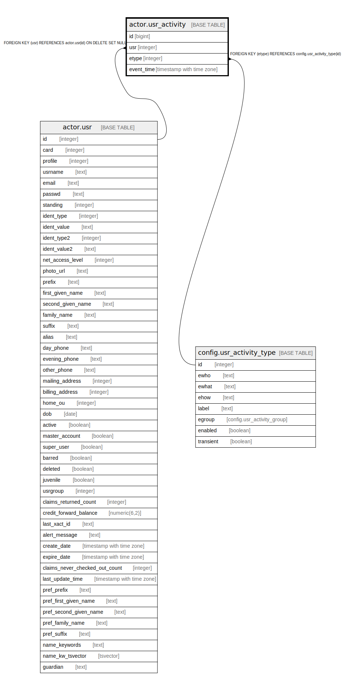

# actor.usr_activity

## Description

## Columns

| Name | Type | Default | Nullable | Children | Parents | Comment |
| ---- | ---- | ------- | -------- | -------- | ------- | ------- |
| id | bigint | nextval('actor.usr_activity_id_seq'::regclass) | false |  |  |  |
| usr | integer |  | true |  | [actor.usr](actor.usr.md) |  |
| etype | integer |  | false |  | [config.usr_activity_type](config.usr_activity_type.md) |  |
| event_time | timestamp with time zone | now() | false |  |  |  |

## Constraints

| Name | Type | Definition |
| ---- | ---- | ---------- |
| usr_activity_pkey | PRIMARY KEY | PRIMARY KEY (id) |
| usr_activity_usr_fkey | FOREIGN KEY | FOREIGN KEY (usr) REFERENCES actor.usr(id) ON DELETE SET NULL |
| usr_activity_etype_fkey | FOREIGN KEY | FOREIGN KEY (etype) REFERENCES config.usr_activity_type(id) |

## Indexes

| Name | Definition |
| ---- | ---------- |
| usr_activity_pkey | CREATE UNIQUE INDEX usr_activity_pkey ON actor.usr_activity USING btree (id) |
| usr_activity_usr_idx | CREATE INDEX usr_activity_usr_idx ON actor.usr_activity USING btree (usr) |

## Triggers

| Name | Definition |
| ---- | ---------- |
| remove_transient_usr_activity | CREATE TRIGGER remove_transient_usr_activity BEFORE INSERT ON actor.usr_activity FOR EACH ROW EXECUTE PROCEDURE actor.usr_activity_transient_trg() |

## Relations

---

> Generated by [tbls](https://github.com/k1LoW/tbls)
