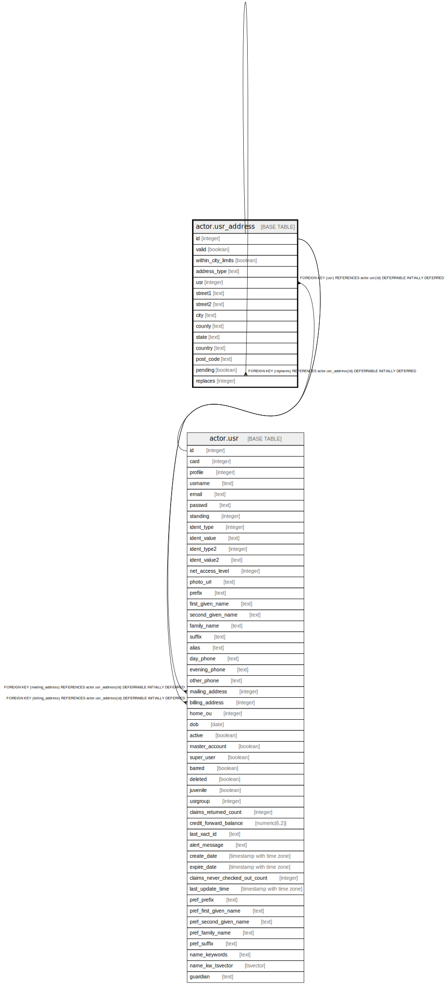

# actor.usr_address

## Description

## Columns

| Name | Type | Default | Nullable | Children | Parents | Comment |
| ---- | ---- | ------- | -------- | -------- | ------- | ------- |
| id | integer | nextval('actor.usr_address_id_seq'::regclass) | false | [actor.usr](actor.usr.md) [actor.usr_address](actor.usr_address.md) |  |  |
| valid | boolean | true | false |  |  |  |
| within_city_limits | boolean | true | false |  |  |  |
| address_type | text | 'MAILING'::text | false |  |  |  |
| usr | integer |  | false |  | [actor.usr](actor.usr.md) |  |
| street1 | text |  | false |  |  |  |
| street2 | text |  | true |  |  |  |
| city | text |  | false |  |  |  |
| county | text |  | true |  |  |  |
| state | text |  | true |  |  |  |
| country | text |  | false |  |  |  |
| post_code | text |  | false |  |  |  |
| pending | boolean | false | false |  |  |  |
| replaces | integer |  | true |  | [actor.usr_address](actor.usr_address.md) |  |

## Constraints

| Name | Type | Definition |
| ---- | ---- | ---------- |
| usr_address_pkey | PRIMARY KEY | PRIMARY KEY (id) |
| usr_address_replaces_fkey | FOREIGN KEY | FOREIGN KEY (replaces) REFERENCES actor.usr_address(id) DEFERRABLE INITIALLY DEFERRED |
| usr_address_usr_fkey | FOREIGN KEY | FOREIGN KEY (usr) REFERENCES actor.usr(id) DEFERRABLE INITIALLY DEFERRED |

## Indexes

| Name | Definition |
| ---- | ---------- |
| usr_address_pkey | CREATE UNIQUE INDEX usr_address_pkey ON actor.usr_address USING btree (id) |
| actor_usr_addr_city_idx | CREATE INDEX actor_usr_addr_city_idx ON actor.usr_address USING btree (lowercase(city)) |
| actor_usr_addr_post_code_idx | CREATE INDEX actor_usr_addr_post_code_idx ON actor.usr_address USING btree (lowercase(post_code)) |
| actor_usr_addr_state_idx | CREATE INDEX actor_usr_addr_state_idx ON actor.usr_address USING btree (lowercase(state)) |
| actor_usr_addr_street1_idx | CREATE INDEX actor_usr_addr_street1_idx ON actor.usr_address USING btree (lowercase(street1)) |
| actor_usr_addr_street2_idx | CREATE INDEX actor_usr_addr_street2_idx ON actor.usr_address USING btree (lowercase(street2)) |
| actor_usr_addr_usr_idx | CREATE INDEX actor_usr_addr_usr_idx ON actor.usr_address USING btree (usr) |

## Triggers

| Name | Definition |
| ---- | ---------- |
| audit_actor_usr_address_update_trigger | CREATE TRIGGER audit_actor_usr_address_update_trigger AFTER DELETE OR UPDATE ON actor.usr_address FOR EACH ROW EXECUTE PROCEDURE auditor.audit_actor_usr_address_func() |

## Relations

---

> Generated by [tbls](https://github.com/k1LoW/tbls)
