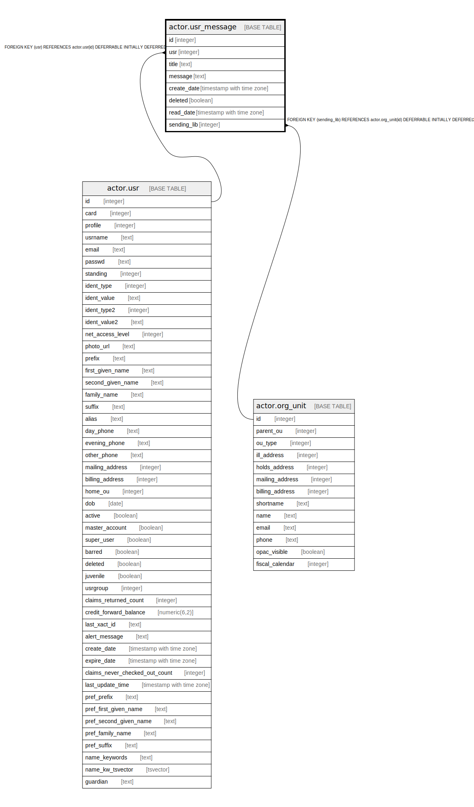

# actor.usr_message

## Description

## Columns

| Name | Type | Default | Nullable | Children | Parents | Comment |
| ---- | ---- | ------- | -------- | -------- | ------- | ------- |
| id | integer | nextval('actor.usr_message_id_seq'::regclass) | false |  |  |  |
| usr | integer |  | false |  | [actor.usr](actor.usr.md) |  |
| title | text |  | true |  |  |  |
| message | text |  | false |  |  |  |
| create_date | timestamp with time zone | now() | false |  |  |  |
| deleted | boolean | false | false |  |  |  |
| read_date | timestamp with time zone |  | true |  |  |  |
| sending_lib | integer |  | false |  | [actor.org_unit](actor.org_unit.md) |  |

## Constraints

| Name | Type | Definition |
| ---- | ---- | ---------- |
| usr_message_sending_lib_fkey | FOREIGN KEY | FOREIGN KEY (sending_lib) REFERENCES actor.org_unit(id) DEFERRABLE INITIALLY DEFERRED |
| usr_message_pkey | PRIMARY KEY | PRIMARY KEY (id) |
| usr_message_usr_fkey | FOREIGN KEY | FOREIGN KEY (usr) REFERENCES actor.usr(id) DEFERRABLE INITIALLY DEFERRED |

## Indexes

| Name | Definition |
| ---- | ---------- |
| usr_message_pkey | CREATE UNIQUE INDEX usr_message_pkey ON actor.usr_message USING btree (id) |
| aum_usr | CREATE INDEX aum_usr ON actor.usr_message USING btree (usr) |

## Relations

---

> Generated by [tbls](https://github.com/k1LoW/tbls)
