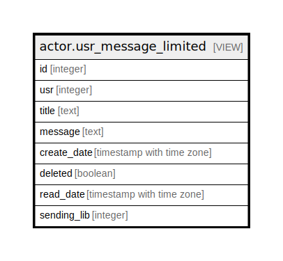

# actor.usr_message_limited

## Description

<details>
<summary><strong>Table Definition</strong></summary>

```sql
CREATE VIEW usr_message_limited AS (
 SELECT usr_message.id,
    usr_message.usr,
    usr_message.title,
    usr_message.message,
    usr_message.create_date,
    usr_message.deleted,
    usr_message.read_date,
    usr_message.sending_lib
   FROM actor.usr_message
)
```

</details>

## Columns

| Name | Type | Default | Nullable | Children | Parents | Comment |
| ---- | ---- | ------- | -------- | -------- | ------- | ------- |
| id | integer |  | true |  |  |  |
| usr | integer |  | true |  |  |  |
| title | text |  | true |  |  |  |
| message | text |  | true |  |  |  |
| create_date | timestamp with time zone |  | true |  |  |  |
| deleted | boolean |  | true |  |  |  |
| read_date | timestamp with time zone |  | true |  |  |  |
| sending_lib | integer |  | true |  |  |  |

## Referenced Tables

| Name | Columns | Comment | Type |
| ---- | ------- | ------- | ---- |
| [actor.usr_message](actor.usr_message.md) | 8 |  | BASE TABLE |

## Triggers

| Name | Definition |
| ---- | ---------- |
| restrict_usr_message_limited_tgr | CREATE TRIGGER restrict_usr_message_limited_tgr INSTEAD OF INSERT OR DELETE OR UPDATE ON actor.usr_message_limited FOR EACH ROW EXECUTE PROCEDURE actor.restrict_usr_message_limited() |

## Relations



---

> Generated by [tbls](https://github.com/k1LoW/tbls)
