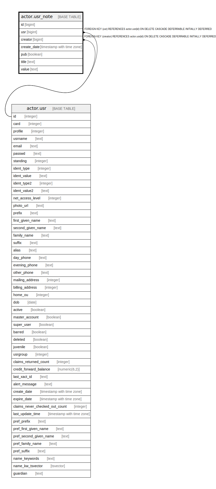

# actor.usr_note

## Description

## Columns

| Name | Type | Default | Nullable | Children | Parents | Comment |
| ---- | ---- | ------- | -------- | -------- | ------- | ------- |
| id | bigint | nextval('actor.usr_note_id_seq'::regclass) | false |  |  |  |
| usr | bigint |  | false |  | [actor.usr](actor.usr.md) |  |
| creator | bigint |  | false |  | [actor.usr](actor.usr.md) |  |
| create_date | timestamp with time zone | now() | true |  |  |  |
| pub | boolean | false | false |  |  |  |
| title | text |  | false |  |  |  |
| value | text |  | false |  |  |  |

## Constraints

| Name | Type | Definition |
| ---- | ---- | ---------- |
| usr_note_pkey | PRIMARY KEY | PRIMARY KEY (id) |
| usr_note_creator_fkey | FOREIGN KEY | FOREIGN KEY (creator) REFERENCES actor.usr(id) ON DELETE CASCADE DEFERRABLE INITIALLY DEFERRED |
| usr_note_usr_fkey | FOREIGN KEY | FOREIGN KEY (usr) REFERENCES actor.usr(id) ON DELETE CASCADE DEFERRABLE INITIALLY DEFERRED |

## Indexes

| Name | Definition |
| ---- | ---------- |
| usr_note_pkey | CREATE UNIQUE INDEX usr_note_pkey ON actor.usr_note USING btree (id) |
| actor_usr_note_creator_idx | CREATE INDEX actor_usr_note_creator_idx ON actor.usr_note USING btree (creator) |
| actor_usr_note_usr_idx | CREATE INDEX actor_usr_note_usr_idx ON actor.usr_note USING btree (usr) |

## Triggers

| Name | Definition |
| ---- | ---------- |
| convert_usr_note_to_message_tgr | CREATE TRIGGER convert_usr_note_to_message_tgr AFTER INSERT OR UPDATE ON actor.usr_note FOR EACH ROW EXECUTE PROCEDURE actor.convert_usr_note_to_message() |

## Relations

---

> Generated by [tbls](https://github.com/k1LoW/tbls)
