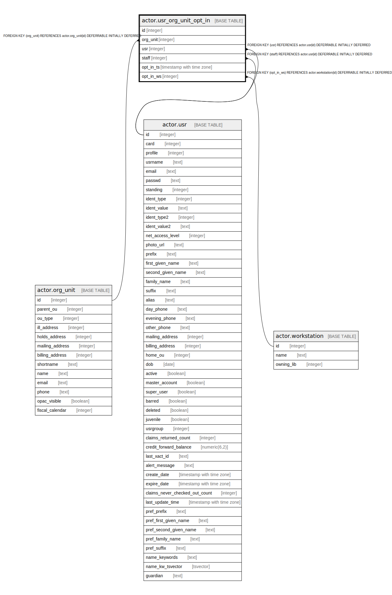

# actor.usr_org_unit_opt_in

## Description

## Columns

| Name | Type | Default | Nullable | Children | Parents | Comment |
| ---- | ---- | ------- | -------- | -------- | ------- | ------- |
| id | integer | nextval('actor.usr_org_unit_opt_in_id_seq'::regclass) | false |  |  |  |
| org_unit | integer |  | false |  | [actor.org_unit](actor.org_unit.md) |  |
| usr | integer |  | false |  | [actor.usr](actor.usr.md) |  |
| staff | integer |  | false |  | [actor.usr](actor.usr.md) |  |
| opt_in_ts | timestamp with time zone | now() | false |  |  |  |
| opt_in_ws | integer |  | false |  | [actor.workstation](actor.workstation.md) |  |

## Constraints

| Name | Type | Definition |
| ---- | ---- | ---------- |
| usr_org_unit_opt_in_org_unit_fkey | FOREIGN KEY | FOREIGN KEY (org_unit) REFERENCES actor.org_unit(id) DEFERRABLE INITIALLY DEFERRED |
| usr_opt_in_once_per_org_unit | UNIQUE | UNIQUE (usr, org_unit) |
| usr_org_unit_opt_in_pkey | PRIMARY KEY | PRIMARY KEY (id) |
| usr_org_unit_opt_in_staff_fkey | FOREIGN KEY | FOREIGN KEY (staff) REFERENCES actor.usr(id) DEFERRABLE INITIALLY DEFERRED |
| usr_org_unit_opt_in_usr_fkey | FOREIGN KEY | FOREIGN KEY (usr) REFERENCES actor.usr(id) DEFERRABLE INITIALLY DEFERRED |
| usr_org_unit_opt_in_opt_in_ws_fkey | FOREIGN KEY | FOREIGN KEY (opt_in_ws) REFERENCES actor.workstation(id) DEFERRABLE INITIALLY DEFERRED |

## Indexes

| Name | Definition |
| ---- | ---------- |
| usr_opt_in_once_per_org_unit | CREATE UNIQUE INDEX usr_opt_in_once_per_org_unit ON actor.usr_org_unit_opt_in USING btree (usr, org_unit) |
| usr_org_unit_opt_in_pkey | CREATE UNIQUE INDEX usr_org_unit_opt_in_pkey ON actor.usr_org_unit_opt_in USING btree (id) |
| usr_org_unit_opt_in_staff_idx | CREATE INDEX usr_org_unit_opt_in_staff_idx ON actor.usr_org_unit_opt_in USING btree (staff) |

## Relations

---

> Generated by [tbls](https://github.com/k1LoW/tbls)
