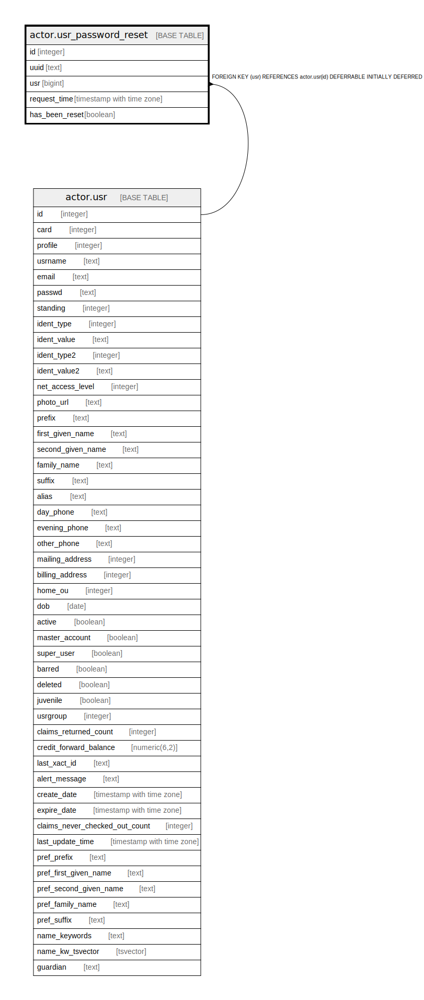

# actor.usr_password_reset

## Description

  
Self-serve password reset requests  

## Columns

| Name | Type | Default | Nullable | Children | Parents | Comment |
| ---- | ---- | ------- | -------- | -------- | ------- | ------- |
| id | integer | nextval('actor.usr_password_reset_id_seq'::regclass) | false |  |  |  |
| uuid | text |  | false |  |  |  |
| usr | bigint |  | false |  | [actor.usr](actor.usr.md) |  |
| request_time | timestamp with time zone | now() | false |  |  |  |
| has_been_reset | boolean | false | false |  |  |  |

## Constraints

| Name | Type | Definition |
| ---- | ---- | ---------- |
| usr_password_reset_pkey | PRIMARY KEY | PRIMARY KEY (id) |
| usr_password_reset_usr_fkey | FOREIGN KEY | FOREIGN KEY (usr) REFERENCES actor.usr(id) DEFERRABLE INITIALLY DEFERRED |

## Indexes

| Name | Definition |
| ---- | ---------- |
| usr_password_reset_pkey | CREATE UNIQUE INDEX usr_password_reset_pkey ON actor.usr_password_reset USING btree (id) |
| actor_usr_password_reset_has_been_reset_idx | CREATE INDEX actor_usr_password_reset_has_been_reset_idx ON actor.usr_password_reset USING btree (has_been_reset) |
| actor_usr_password_reset_request_time_idx | CREATE INDEX actor_usr_password_reset_request_time_idx ON actor.usr_password_reset USING btree (request_time) |
| actor_usr_password_reset_usr_idx | CREATE INDEX actor_usr_password_reset_usr_idx ON actor.usr_password_reset USING btree (usr) |
| actor_usr_password_reset_uuid_idx | CREATE UNIQUE INDEX actor_usr_password_reset_uuid_idx ON actor.usr_password_reset USING btree (uuid) |

## Relations

---

> Generated by [tbls](https://github.com/k1LoW/tbls)
