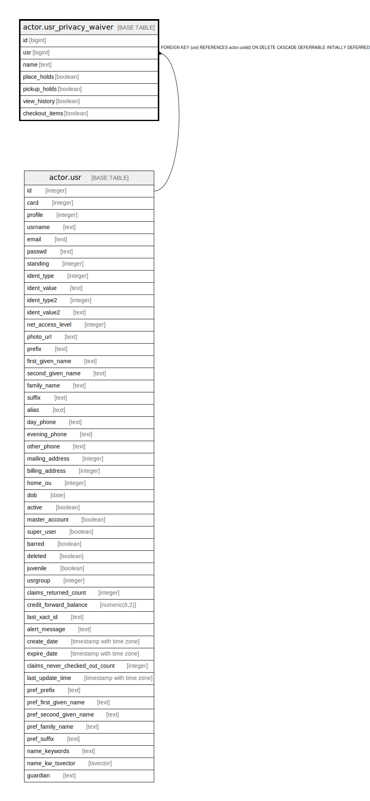

# actor.usr_privacy_waiver

## Description

## Columns

| Name | Type | Default | Nullable | Children | Parents | Comment |
| ---- | ---- | ------- | -------- | -------- | ------- | ------- |
| id | bigint | nextval('actor.usr_privacy_waiver_id_seq'::regclass) | false |  |  |  |
| usr | bigint |  | false |  | [actor.usr](actor.usr.md) |  |
| name | text |  | false |  |  |  |
| place_holds | boolean | false | true |  |  |  |
| pickup_holds | boolean | false | true |  |  |  |
| view_history | boolean | false | true |  |  |  |
| checkout_items | boolean | false | true |  |  |  |

## Constraints

| Name | Type | Definition |
| ---- | ---- | ---------- |
| usr_privacy_waiver_usr_fkey | FOREIGN KEY | FOREIGN KEY (usr) REFERENCES actor.usr(id) ON DELETE CASCADE DEFERRABLE INITIALLY DEFERRED |
| usr_privacy_waiver_pkey | PRIMARY KEY | PRIMARY KEY (id) |

## Indexes

| Name | Definition |
| ---- | ---------- |
| usr_privacy_waiver_pkey | CREATE UNIQUE INDEX usr_privacy_waiver_pkey ON actor.usr_privacy_waiver USING btree (id) |
| actor_usr_privacy_waiver_usr_idx | CREATE INDEX actor_usr_privacy_waiver_usr_idx ON actor.usr_privacy_waiver USING btree (usr) |

## Relations

---

> Generated by [tbls](https://github.com/k1LoW/tbls)
