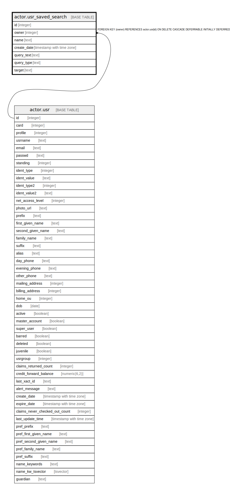

# actor.usr_saved_search

## Description

## Columns

| Name | Type | Default | Nullable | Children | Parents | Comment |
| ---- | ---- | ------- | -------- | -------- | ------- | ------- |
| id | integer | nextval('actor.usr_saved_search_id_seq'::regclass) | false |  |  |  |
| owner | integer |  | false |  | [actor.usr](actor.usr.md) |  |
| name | text |  | false |  |  |  |
| create_date | timestamp with time zone | now() | false |  |  |  |
| query_text | text |  | false |  |  |  |
| query_type | text | 'URL'::text | false |  |  |  |
| target | text |  | false |  |  |  |

## Constraints

| Name | Type | Definition |
| ---- | ---- | ---------- |
| valid_query_text | CHECK | CHECK ((query_type = 'URL'::text)) |
| valid_target | CHECK | CHECK ((target = ANY (ARRAY['record'::text, 'metarecord'::text, 'callnumber'::text]))) |
| name_once_per_user | UNIQUE | UNIQUE (owner, name) |
| usr_saved_search_owner_fkey | FOREIGN KEY | FOREIGN KEY (owner) REFERENCES actor.usr(id) ON DELETE CASCADE DEFERRABLE INITIALLY DEFERRED |
| usr_saved_search_pkey | PRIMARY KEY | PRIMARY KEY (id) |

## Indexes

| Name | Definition |
| ---- | ---------- |
| name_once_per_user | CREATE UNIQUE INDEX name_once_per_user ON actor.usr_saved_search USING btree (owner, name) |
| usr_saved_search_pkey | CREATE UNIQUE INDEX usr_saved_search_pkey ON actor.usr_saved_search USING btree (id) |

## Relations

---

> Generated by [tbls](https://github.com/k1LoW/tbls)
