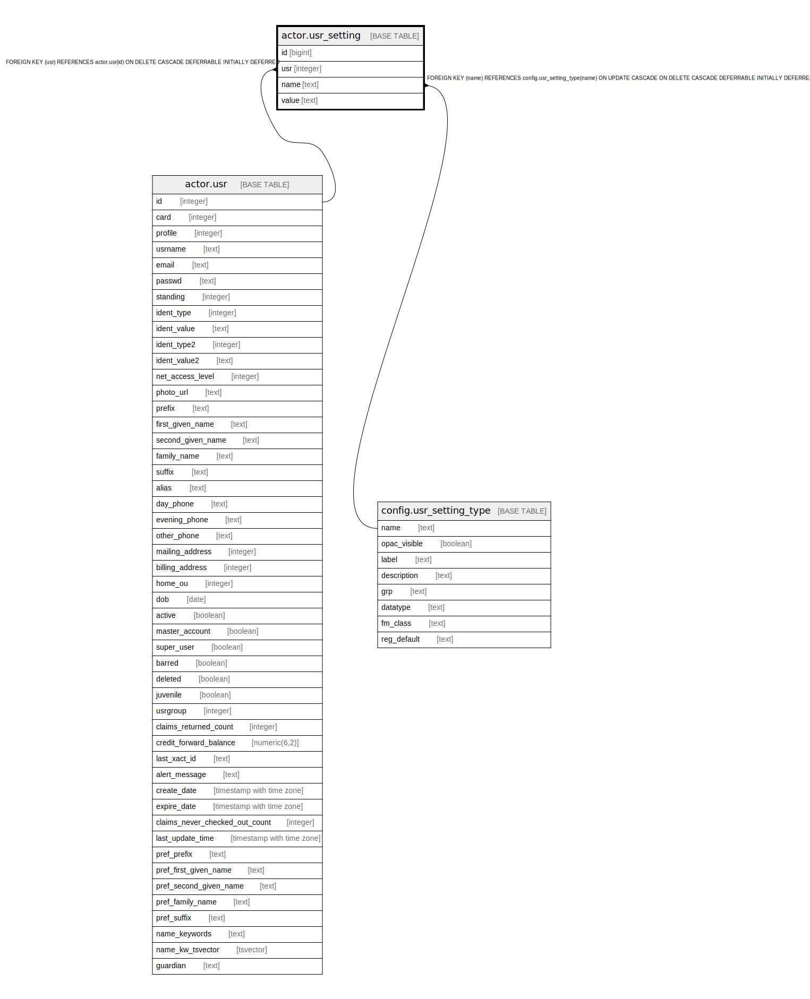

# actor.usr_setting

## Description

  
User settings  
  
This table contains any arbitrary settings that a client  
program would like to save for a user.  

## Columns

| Name | Type | Default | Nullable | Children | Parents | Comment |
| ---- | ---- | ------- | -------- | -------- | ------- | ------- |
| id | bigint | nextval('actor.usr_setting_id_seq'::regclass) | false |  |  |  |
| usr | integer |  | false |  | [actor.usr](actor.usr.md) |  |
| name | text |  | false |  | [config.usr_setting_type](config.usr_setting_type.md) |  |
| value | text |  | false |  |  |  |

## Constraints

| Name | Type | Definition |
| ---- | ---- | ---------- |
| usr_once_per_key | UNIQUE | UNIQUE (usr, name) |
| usr_setting_usr_fkey | FOREIGN KEY | FOREIGN KEY (usr) REFERENCES actor.usr(id) ON DELETE CASCADE DEFERRABLE INITIALLY DEFERRED |
| usr_setting_pkey | PRIMARY KEY | PRIMARY KEY (id) |
| usr_setting_name_fkey | FOREIGN KEY | FOREIGN KEY (name) REFERENCES config.usr_setting_type(name) ON UPDATE CASCADE ON DELETE CASCADE DEFERRABLE INITIALLY DEFERRED |

## Indexes

| Name | Definition |
| ---- | ---------- |
| usr_once_per_key | CREATE UNIQUE INDEX usr_once_per_key ON actor.usr_setting USING btree (usr, name) |
| usr_setting_pkey | CREATE UNIQUE INDEX usr_setting_pkey ON actor.usr_setting USING btree (id) |
| actor_usr_setting_usr_idx | CREATE INDEX actor_usr_setting_usr_idx ON actor.usr_setting USING btree (usr) |

## Relations

---

> Generated by [tbls](https://github.com/k1LoW/tbls)
