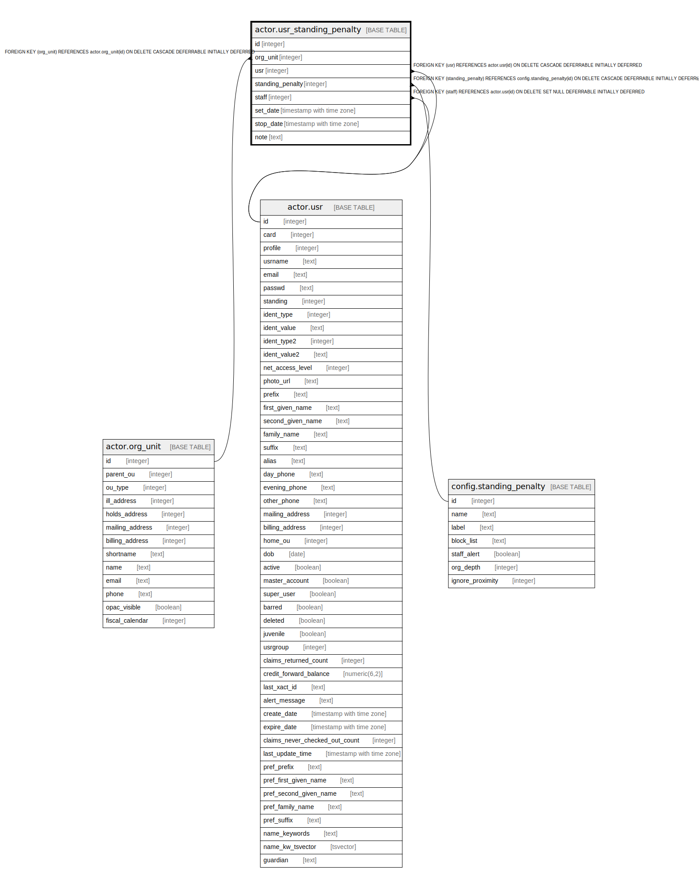

# actor.usr_standing_penalty

## Description

  
User standing penalties  

## Columns

| Name | Type | Default | Nullable | Children | Parents | Comment |
| ---- | ---- | ------- | -------- | -------- | ------- | ------- |
| id | integer | nextval('actor.usr_standing_penalty_id_seq'::regclass) | false |  |  |  |
| org_unit | integer |  | false |  | [actor.org_unit](actor.org_unit.md) |  |
| usr | integer |  | false |  | [actor.usr](actor.usr.md) |  |
| standing_penalty | integer |  | false |  | [config.standing_penalty](config.standing_penalty.md) |  |
| staff | integer |  | true |  | [actor.usr](actor.usr.md) |  |
| set_date | timestamp with time zone | now() | true |  |  |  |
| stop_date | timestamp with time zone |  | true |  |  |  |
| note | text |  | true |  |  |  |

## Constraints

| Name | Type | Definition |
| ---- | ---- | ---------- |
| usr_standing_penalty_org_unit_fkey | FOREIGN KEY | FOREIGN KEY (org_unit) REFERENCES actor.org_unit(id) ON DELETE CASCADE DEFERRABLE INITIALLY DEFERRED |
| usr_standing_penalty_staff_fkey | FOREIGN KEY | FOREIGN KEY (staff) REFERENCES actor.usr(id) ON DELETE SET NULL DEFERRABLE INITIALLY DEFERRED |
| usr_standing_penalty_usr_fkey | FOREIGN KEY | FOREIGN KEY (usr) REFERENCES actor.usr(id) ON DELETE CASCADE DEFERRABLE INITIALLY DEFERRED |
| usr_standing_penalty_pkey | PRIMARY KEY | PRIMARY KEY (id) |
| usr_standing_penalty_standing_penalty_fkey | FOREIGN KEY | FOREIGN KEY (standing_penalty) REFERENCES config.standing_penalty(id) ON DELETE CASCADE DEFERRABLE INITIALLY DEFERRED |

## Indexes

| Name | Definition |
| ---- | ---------- |
| usr_standing_penalty_pkey | CREATE UNIQUE INDEX usr_standing_penalty_pkey ON actor.usr_standing_penalty USING btree (id) |
| actor_usr_standing_penalty_staff_idx | CREATE INDEX actor_usr_standing_penalty_staff_idx ON actor.usr_standing_penalty USING btree (staff) |
| actor_usr_standing_penalty_usr_idx | CREATE INDEX actor_usr_standing_penalty_usr_idx ON actor.usr_standing_penalty USING btree (usr) |

## Relations

---

> Generated by [tbls](https://github.com/k1LoW/tbls)
