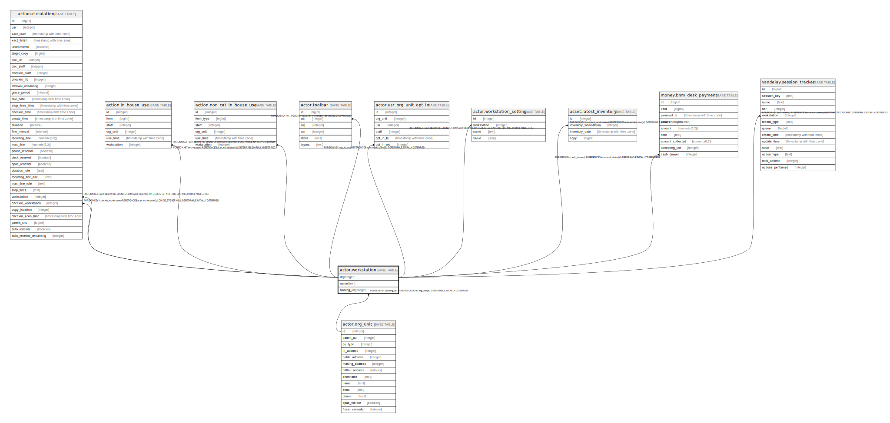

# actor.workstation

## Description

## Columns

| Name | Type | Default | Nullable | Children | Parents | Comment |
| ---- | ---- | ------- | -------- | -------- | ------- | ------- |
| id | integer | nextval('actor.workstation_id_seq'::regclass) | false | [action.circulation](action.circulation.md) [action.in_house_use](action.in_house_use.md) [action.non_cat_in_house_use](action.non_cat_in_house_use.md) [actor.toolbar](actor.toolbar.md) [actor.usr_org_unit_opt_in](actor.usr_org_unit_opt_in.md) [actor.workstation_setting](actor.workstation_setting.md) [asset.latest_inventory](asset.latest_inventory.md) [money.bnm_desk_payment](money.bnm_desk_payment.md) [vandelay.session_tracker](vandelay.session_tracker.md) |  |  |
| name | text |  | false |  |  |  |
| owning_lib | integer |  | false |  | [actor.org_unit](actor.org_unit.md) |  |

## Constraints

| Name | Type | Definition |
| ---- | ---- | ---------- |
| workstation_owning_lib_fkey | FOREIGN KEY | FOREIGN KEY (owning_lib) REFERENCES actor.org_unit(id) DEFERRABLE INITIALLY DEFERRED |
| workstation_name_key | UNIQUE | UNIQUE (name) |
| workstation_pkey | PRIMARY KEY | PRIMARY KEY (id) |

## Indexes

| Name | Definition |
| ---- | ---------- |
| workstation_name_key | CREATE UNIQUE INDEX workstation_name_key ON actor.workstation USING btree (name) |
| workstation_pkey | CREATE UNIQUE INDEX workstation_pkey ON actor.workstation USING btree (id) |

## Relations

---

> Generated by [tbls](https://github.com/k1LoW/tbls)
