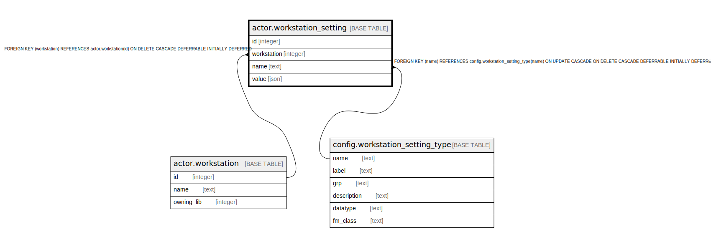

# actor.workstation_setting

## Description

## Columns

| Name | Type | Default | Nullable | Children | Parents | Comment |
| ---- | ---- | ------- | -------- | -------- | ------- | ------- |
| id | integer | nextval('actor.workstation_setting_id_seq'::regclass) | false |  |  |  |
| workstation | integer |  | false |  | [actor.workstation](actor.workstation.md) |  |
| name | text |  | false |  | [config.workstation_setting_type](config.workstation_setting_type.md) |  |
| value | json |  | false |  |  |  |

## Constraints

| Name | Type | Definition |
| ---- | ---- | ---------- |
| workstation_setting_workstation_fkey | FOREIGN KEY | FOREIGN KEY (workstation) REFERENCES actor.workstation(id) ON DELETE CASCADE DEFERRABLE INITIALLY DEFERRED |
| workstation_setting_pkey | PRIMARY KEY | PRIMARY KEY (id) |
| ws_once_per_key | UNIQUE | UNIQUE (workstation, name) |
| workstation_setting_name_fkey | FOREIGN KEY | FOREIGN KEY (name) REFERENCES config.workstation_setting_type(name) ON UPDATE CASCADE ON DELETE CASCADE DEFERRABLE INITIALLY DEFERRED |

## Indexes

| Name | Definition |
| ---- | ---------- |
| workstation_setting_pkey | CREATE UNIQUE INDEX workstation_setting_pkey ON actor.workstation_setting USING btree (id) |
| ws_once_per_key | CREATE UNIQUE INDEX ws_once_per_key ON actor.workstation_setting USING btree (workstation, name) |
| actor_workstation_setting_workstation_idx | CREATE INDEX actor_workstation_setting_workstation_idx ON actor.workstation_setting USING btree (workstation) |

## Relations

---

> Generated by [tbls](https://github.com/k1LoW/tbls)
