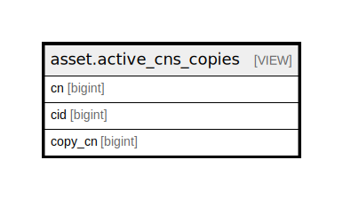

# asset.active_cns_copies

## Description

<details>
<summary><strong>Table Definition</strong></summary>

```sql
CREATE VIEW active_cns_copies AS (
 SELECT call_number.id AS cn,
    copy.id AS cid,
    copy.call_number AS copy_cn
   FROM (asset.call_number
     JOIN asset.copy ON ((call_number.record = copy.id)))
  WHERE ((call_number.label !~~ 'On Order%'::text) AND (copy.status = ANY (ARRAY[0, 1, 6, 7, 8, 103, 104, 105])))
)
```

</details>

## Columns

| Name | Type | Default | Nullable | Children | Parents | Comment |
| ---- | ---- | ------- | -------- | -------- | ------- | ------- |
| cn | bigint |  | true |  |  |  |
| cid | bigint |  | true |  |  |  |
| copy_cn | bigint |  | true |  |  |  |

## Referenced Tables

| Name | Columns | Comment | Type |
| ---- | ------- | ------- | ---- |
| [asset.call_number](asset.call_number.md) | 13 |  | BASE TABLE |
| [asset.copy](asset.copy.md) | 33 |  | BASE TABLE |

## Relations



---

> Generated by [tbls](https://github.com/k1LoW/tbls)
