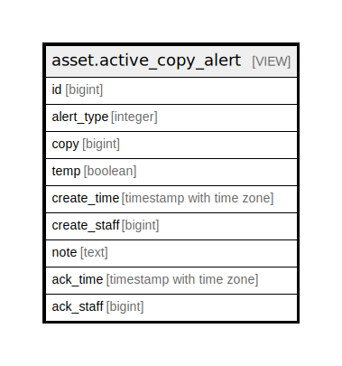

# asset.active_copy_alert

## Description

<details>
<summary><strong>Table Definition</strong></summary>

```sql
CREATE VIEW active_copy_alert AS (
 SELECT copy_alert.id,
    copy_alert.alert_type,
    copy_alert.copy,
    copy_alert.temp,
    copy_alert.create_time,
    copy_alert.create_staff,
    copy_alert.note,
    copy_alert.ack_time,
    copy_alert.ack_staff
   FROM asset.copy_alert
  WHERE (copy_alert.ack_time IS NULL)
)
```

</details>

## Columns

| Name | Type | Default | Nullable | Children | Parents | Comment |
| ---- | ---- | ------- | -------- | -------- | ------- | ------- |
| id | bigint |  | true |  |  |  |
| alert_type | integer |  | true |  |  |  |
| copy | bigint |  | true |  |  |  |
| temp | boolean |  | true |  |  |  |
| create_time | timestamp with time zone |  | true |  |  |  |
| create_staff | bigint |  | true |  |  |  |
| note | text |  | true |  |  |  |
| ack_time | timestamp with time zone |  | true |  |  |  |
| ack_staff | bigint |  | true |  |  |  |

## Referenced Tables

| Name | Columns | Comment | Type |
| ---- | ------- | ------- | ---- |
| [asset.copy_alert](asset.copy_alert.md) | 9 |  | BASE TABLE |

## Relations



---

> Generated by [tbls](https://github.com/k1LoW/tbls)
