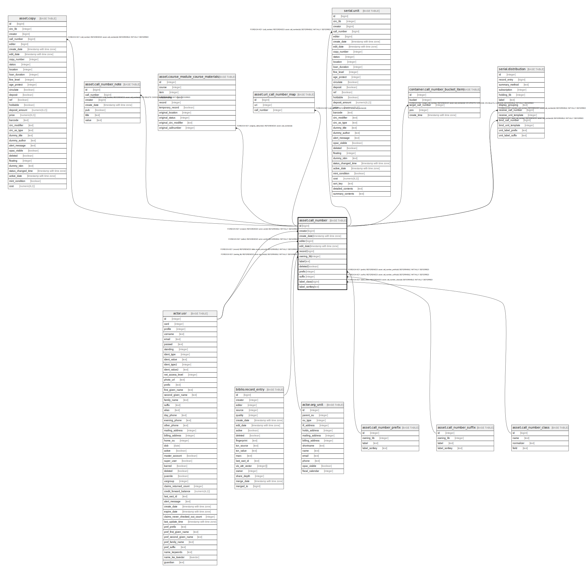

# asset.call_number

## Description

## Columns

| Name | Type | Default | Nullable | Children | Parents | Comment |
| ---- | ---- | ------- | -------- | -------- | ------- | ------- |
| id | bigint | nextval('asset.call_number_id_seq'::regclass) | false | [asset.copy](asset.copy.md) [asset.call_number_note](asset.call_number_note.md) [asset.course_module_course_materials](asset.course_module_course_materials.md) [asset.uri_call_number_map](asset.uri_call_number_map.md) [serial.unit](serial.unit.md) [container.call_number_bucket_item](container.call_number_bucket_item.md) [serial.distribution](serial.distribution.md) |  |  |
| creator | bigint |  | false |  | [actor.usr](actor.usr.md) |  |
| create_date | timestamp with time zone | now() | true |  |  |  |
| editor | bigint |  | false |  | [actor.usr](actor.usr.md) |  |
| edit_date | timestamp with time zone | now() | true |  |  |  |
| record | bigint |  | false |  | [biblio.record_entry](biblio.record_entry.md) |  |
| owning_lib | integer |  | false |  | [actor.org_unit](actor.org_unit.md) |  |
| label | text |  | false |  |  |  |
| deleted | boolean | false | false |  |  |  |
| prefix | integer | '-1'::integer | false |  | [asset.call_number_prefix](asset.call_number_prefix.md) |  |
| suffix | integer | '-1'::integer | false |  | [asset.call_number_suffix](asset.call_number_suffix.md) |  |
| label_class | bigint |  | false |  | [asset.call_number_class](asset.call_number_class.md) |  |
| label_sortkey | text |  | true |  |  |  |

## Constraints

| Name | Type | Definition |
| ---- | ---- | ---------- |
| asset_call_number_owning_lib_fkey | FOREIGN KEY | FOREIGN KEY (owning_lib) REFERENCES actor.org_unit(id) DEFERRABLE INITIALLY DEFERRED |
| asset_call_number_creator_fkey | FOREIGN KEY | FOREIGN KEY (creator) REFERENCES actor.usr(id) DEFERRABLE INITIALLY DEFERRED |
| asset_call_number_editor_fkey | FOREIGN KEY | FOREIGN KEY (editor) REFERENCES actor.usr(id) DEFERRABLE INITIALLY DEFERRED |
| call_number_label_class_fkey | FOREIGN KEY | FOREIGN KEY (label_class) REFERENCES asset.call_number_class(id) DEFERRABLE INITIALLY DEFERRED |
| call_number_pkey | PRIMARY KEY | PRIMARY KEY (id) |
| call_number_prefix_fkey | FOREIGN KEY | FOREIGN KEY (prefix) REFERENCES asset.call_number_prefix(id) DEFERRABLE INITIALLY DEFERRED |
| call_number_suffix_fkey | FOREIGN KEY | FOREIGN KEY (suffix) REFERENCES asset.call_number_suffix(id) DEFERRABLE INITIALLY DEFERRED |
| asset_call_number_record_fkey | FOREIGN KEY | FOREIGN KEY (record) REFERENCES biblio.record_entry(id) DEFERRABLE INITIALLY DEFERRED |

## Indexes

| Name | Definition |
| ---- | ---------- |
| call_number_pkey | CREATE UNIQUE INDEX call_number_pkey ON asset.call_number USING btree (id) |
| asset_call_number_creator_idx | CREATE INDEX asset_call_number_creator_idx ON asset.call_number USING btree (creator) |
| asset_call_number_dewey_idx | CREATE INDEX asset_call_number_dewey_idx ON asset.call_number USING btree (call_number_dewey(label)) |
| asset_call_number_editor_idx | CREATE INDEX asset_call_number_editor_idx ON asset.call_number USING btree (editor) |
| asset_call_number_label_once_per_lib | CREATE UNIQUE INDEX asset_call_number_label_once_per_lib ON asset.call_number USING btree (record, owning_lib, label, prefix, suffix) WHERE ((deleted = false) OR (deleted IS FALSE)) |
| asset_call_number_label_sortkey | CREATE INDEX asset_call_number_label_sortkey ON asset.call_number USING btree (oils_text_as_bytea(label_sortkey)) |
| asset_call_number_label_sortkey_browse | CREATE INDEX asset_call_number_label_sortkey_browse ON asset.call_number USING btree (oils_text_as_bytea(label_sortkey), oils_text_as_bytea(label), id, owning_lib) WHERE ((deleted IS FALSE) OR (deleted = false)) |
| asset_call_number_record_idx | CREATE INDEX asset_call_number_record_idx ON asset.call_number USING btree (record) |
| asset_call_number_upper_label_id_owning_lib_idx | CREATE INDEX asset_call_number_upper_label_id_owning_lib_idx ON asset.call_number USING btree (oils_text_as_bytea(label), id, owning_lib) |

## Triggers

| Name | Definition |
| ---- | ---------- |
| asset_label_sortkey_trigger | CREATE TRIGGER asset_label_sortkey_trigger BEFORE INSERT OR UPDATE ON asset.call_number FOR EACH ROW EXECUTE PROCEDURE asset.label_normalizer() |
| audit_asset_call_number_update_trigger | CREATE TRIGGER audit_asset_call_number_update_trigger AFTER DELETE OR UPDATE ON asset.call_number FOR EACH ROW EXECUTE PROCEDURE auditor.audit_asset_call_number_func() |
| z_opac_vis_mat_view_tgr | CREATE TRIGGER z_opac_vis_mat_view_tgr AFTER INSERT OR DELETE OR UPDATE ON asset.call_number FOR EACH ROW EXECUTE PROCEDURE asset.cache_copy_visibility() |

## Relations

---

> Generated by [tbls](https://github.com/k1LoW/tbls)
