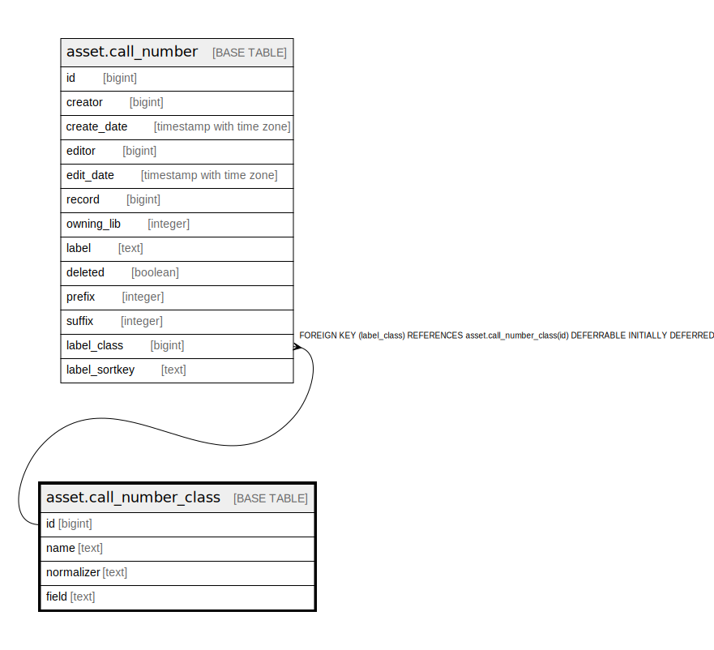

# asset.call_number_class

## Description

  
Defines the call number normalization database functions in the "normalizer"  
column and the tag/subfield combinations to use to lookup the call number in  
the "field" column for a given classification scheme. Tag/subfield combinations  
are delimited by commas.  

## Columns

| Name | Type | Default | Nullable | Children | Parents | Comment |
| ---- | ---- | ------- | -------- | -------- | ------- | ------- |
| id | bigint | nextval('asset.call_number_class_id_seq'::regclass) | false | [asset.call_number](asset.call_number.md) |  |  |
| name | text |  | false |  |  |  |
| normalizer | text | 'asset.normalize_generic'::text | false |  |  |  |
| field | text | '050ab,055ab,060ab,070ab,080ab,082ab,086ab,088ab,090,092,096,098,099'::text | false |  |  |  |

## Constraints

| Name | Type | Definition |
| ---- | ---- | ---------- |
| call_number_class_pkey | PRIMARY KEY | PRIMARY KEY (id) |

## Indexes

| Name | Definition |
| ---- | ---------- |
| call_number_class_pkey | CREATE UNIQUE INDEX call_number_class_pkey ON asset.call_number_class USING btree (id) |

## Relations

---

> Generated by [tbls](https://github.com/k1LoW/tbls)
