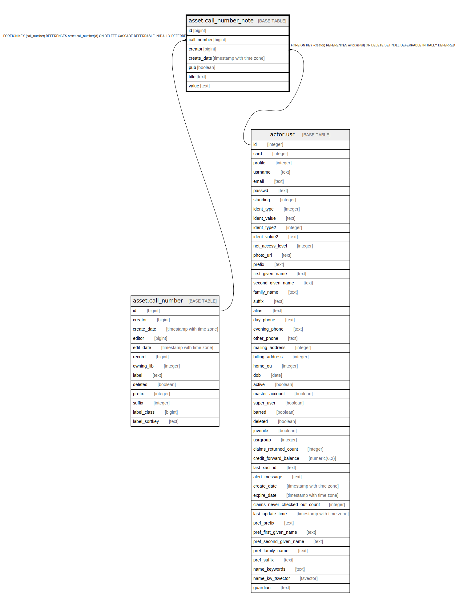

# asset.call_number_note

## Description

## Columns

| Name | Type | Default | Nullable | Children | Parents | Comment |
| ---- | ---- | ------- | -------- | -------- | ------- | ------- |
| id | bigint | nextval('asset.call_number_note_id_seq'::regclass) | false |  |  |  |
| call_number | bigint |  | false |  | [asset.call_number](asset.call_number.md) |  |
| creator | bigint |  | false |  | [actor.usr](actor.usr.md) |  |
| create_date | timestamp with time zone | now() | true |  |  |  |
| pub | boolean | false | false |  |  |  |
| title | text |  | false |  |  |  |
| value | text |  | false |  |  |  |

## Constraints

| Name | Type | Definition |
| ---- | ---- | ---------- |
| asset_call_number_note_creator_fkey | FOREIGN KEY | FOREIGN KEY (creator) REFERENCES actor.usr(id) ON DELETE SET NULL DEFERRABLE INITIALLY DEFERRED |
| call_number_note_pkey | PRIMARY KEY | PRIMARY KEY (id) |
| asset_call_number_note_record_fkey | FOREIGN KEY | FOREIGN KEY (call_number) REFERENCES asset.call_number(id) ON DELETE CASCADE DEFERRABLE INITIALLY DEFERRED |

## Indexes

| Name | Definition |
| ---- | ---------- |
| call_number_note_pkey | CREATE UNIQUE INDEX call_number_note_pkey ON asset.call_number_note USING btree (id) |
| asset_call_number_note_creator_idx | CREATE INDEX asset_call_number_note_creator_idx ON asset.call_number_note USING btree (creator) |

## Relations

---

> Generated by [tbls](https://github.com/k1LoW/tbls)
