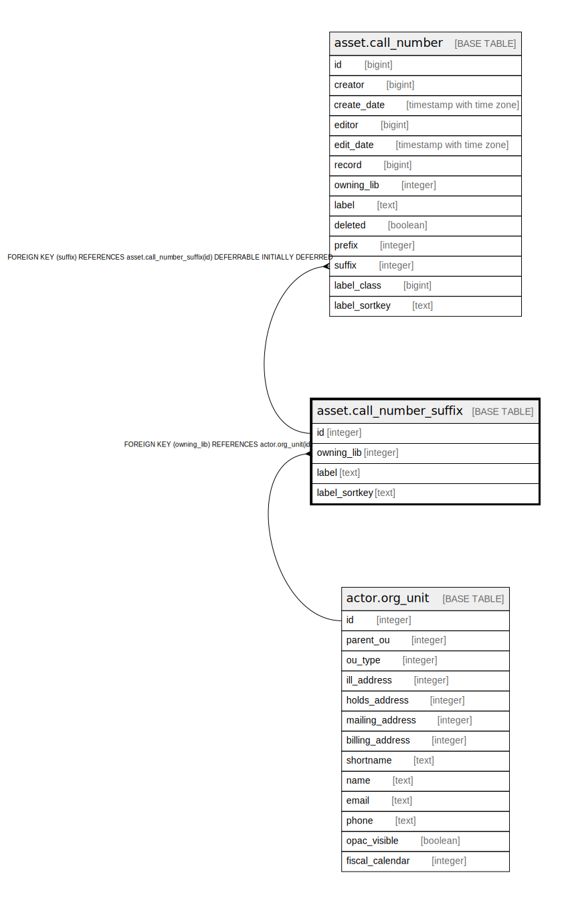

# asset.call_number_suffix

## Description

## Columns

| Name | Type | Default | Nullable | Children | Parents | Comment |
| ---- | ---- | ------- | -------- | -------- | ------- | ------- |
| id | integer | nextval('asset.call_number_suffix_id_seq'::regclass) | false | [asset.call_number](asset.call_number.md) |  |  |
| owning_lib | integer |  | false |  | [actor.org_unit](actor.org_unit.md) |  |
| label | text |  | false |  |  |  |
| label_sortkey | text |  | true |  |  |  |

## Constraints

| Name | Type | Definition |
| ---- | ---- | ---------- |
| call_number_suffix_owning_lib_fkey | FOREIGN KEY | FOREIGN KEY (owning_lib) REFERENCES actor.org_unit(id) |
| call_number_suffix_pkey | PRIMARY KEY | PRIMARY KEY (id) |

## Indexes

| Name | Definition |
| ---- | ---------- |
| call_number_suffix_pkey | CREATE UNIQUE INDEX call_number_suffix_pkey ON asset.call_number_suffix USING btree (id) |
| asset_call_number_suffix_once_per_lib | CREATE UNIQUE INDEX asset_call_number_suffix_once_per_lib ON asset.call_number_suffix USING btree (label, owning_lib) |
| asset_call_number_suffix_sortkey_idx | CREATE INDEX asset_call_number_suffix_sortkey_idx ON asset.call_number_suffix USING btree (label_sortkey) |

## Triggers

| Name | Definition |
| ---- | ---------- |
| suffix_normalize_tgr | CREATE TRIGGER suffix_normalize_tgr BEFORE INSERT OR UPDATE ON asset.call_number_suffix FOR EACH ROW EXECUTE PROCEDURE asset.normalize_affix_sortkey() |

## Relations

---

> Generated by [tbls](https://github.com/k1LoW/tbls)
