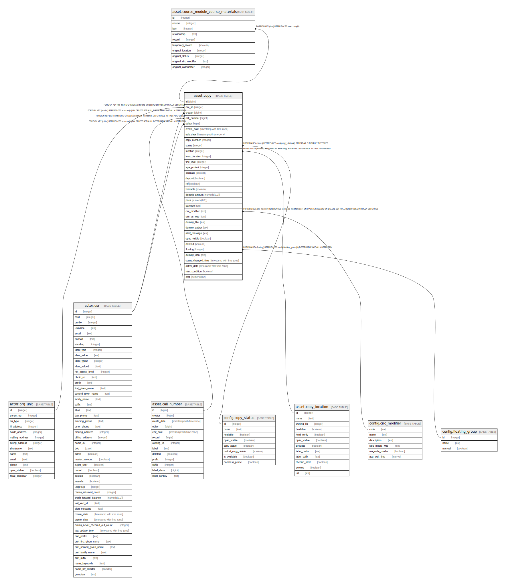

# asset.copy

## Description

## Columns

| Name | Type | Default | Nullable | Children | Parents | Comment |
| ---- | ---- | ------- | -------- | -------- | ------- | ------- |
| id | bigint | nextval('asset.copy_id_seq'::regclass) | false | [asset.course_module_course_materials](asset.course_module_course_materials.md) |  |  |
| circ_lib | integer |  | false |  | [actor.org_unit](actor.org_unit.md) |  |
| creator | bigint |  | false |  | [actor.usr](actor.usr.md) |  |
| call_number | bigint |  | false |  | [asset.call_number](asset.call_number.md) |  |
| editor | bigint |  | false |  | [actor.usr](actor.usr.md) |  |
| create_date | timestamp with time zone | now() | true |  |  |  |
| edit_date | timestamp with time zone | now() | true |  |  |  |
| copy_number | integer |  | true |  |  |  |
| status | integer | 0 | false |  | [config.copy_status](config.copy_status.md) |  |
| location | integer | 1 | false |  | [asset.copy_location](asset.copy_location.md) |  |
| loan_duration | integer |  | false |  |  |  |
| fine_level | integer |  | false |  |  |  |
| age_protect | integer |  | true |  |  |  |
| circulate | boolean | true | false |  |  |  |
| deposit | boolean | false | false |  |  |  |
| ref | boolean | false | false |  |  |  |
| holdable | boolean | true | false |  |  |  |
| deposit_amount | numeric(6,2) | 0.00 | false |  |  |  |
| price | numeric(8,2) |  | true |  |  |  |
| barcode | text |  | false |  |  |  |
| circ_modifier | text |  | true |  | [config.circ_modifier](config.circ_modifier.md) |  |
| circ_as_type | text |  | true |  |  |  |
| dummy_title | text |  | true |  |  |  |
| dummy_author | text |  | true |  |  |  |
| alert_message | text |  | true |  |  |  |
| opac_visible | boolean | true | false |  |  |  |
| deleted | boolean | false | false |  |  |  |
| floating | integer |  | true |  | [config.floating_group](config.floating_group.md) |  |
| dummy_isbn | text |  | true |  |  |  |
| status_changed_time | timestamp with time zone |  | true |  |  |  |
| active_date | timestamp with time zone |  | true |  |  |  |
| mint_condition | boolean | true | false |  |  |  |
| cost | numeric(8,2) |  | true |  |  |  |

## Constraints

| Name | Type | Definition |
| ---- | ---- | ---------- |
| copy_fine_level_check | CHECK | CHECK ((fine_level = ANY (ARRAY[1, 2, 3]))) |
| copy_loan_duration_check | CHECK | CHECK ((loan_duration = ANY (ARRAY[1, 2, 3]))) |
| copy_circ_lib_fkey | FOREIGN KEY | FOREIGN KEY (circ_lib) REFERENCES actor.org_unit(id) DEFERRABLE INITIALLY DEFERRED |
| asset_copy_creator_fkey | FOREIGN KEY | FOREIGN KEY (creator) REFERENCES actor.usr(id) ON DELETE SET NULL DEFERRABLE INITIALLY DEFERRED |
| asset_copy_editor_fkey | FOREIGN KEY | FOREIGN KEY (editor) REFERENCES actor.usr(id) ON DELETE SET NULL DEFERRABLE INITIALLY DEFERRED |
| asset_copy_call_number_fkey | FOREIGN KEY | FOREIGN KEY (call_number) REFERENCES asset.call_number(id) DEFERRABLE INITIALLY DEFERRED |
| copy_location_fkey | FOREIGN KEY | FOREIGN KEY (location) REFERENCES asset.copy_location(id) DEFERRABLE INITIALLY DEFERRED |
| copy_pkey | PRIMARY KEY | PRIMARY KEY (id) |
| circ_mod_fkey | FOREIGN KEY | FOREIGN KEY (circ_modifier) REFERENCES config.circ_modifier(code) ON UPDATE CASCADE ON DELETE SET NULL DEFERRABLE INITIALLY DEFERRED |
| copy_status_fkey | FOREIGN KEY | FOREIGN KEY (status) REFERENCES config.copy_status(id) DEFERRABLE INITIALLY DEFERRED |
| asset_copy_floating_fkey | FOREIGN KEY | FOREIGN KEY (floating) REFERENCES config.floating_group(id) DEFERRABLE INITIALLY DEFERRED |

## Indexes

| Name | Definition |
| ---- | ---------- |
| copy_pkey | CREATE UNIQUE INDEX copy_pkey ON asset.copy USING btree (id) |
| copy_barcode_key | CREATE UNIQUE INDEX copy_barcode_key ON asset.copy USING btree (barcode) WHERE ((deleted = false) OR (deleted IS FALSE)) |
| cp_avail_cn_idx | CREATE INDEX cp_avail_cn_idx ON asset.copy USING btree (call_number) |
| cp_available_by_circ_lib_idx | CREATE INDEX cp_available_by_circ_lib_idx ON asset.copy USING btree (circ_lib) WHERE (status = ANY (ARRAY[0, 7])) |
| cp_cn_idx | CREATE INDEX cp_cn_idx ON asset.copy USING btree (call_number) |
| cp_create_date | CREATE INDEX cp_create_date ON asset.copy USING btree (create_date) |
| cp_creator_idx | CREATE INDEX cp_creator_idx ON asset.copy USING btree (creator) |
| cp_editor_idx | CREATE INDEX cp_editor_idx ON asset.copy USING btree (editor) |

## Triggers

| Name | Definition |
| ---- | ---------- |
| acp_created_trig | CREATE TRIGGER acp_created_trig BEFORE INSERT ON asset.copy FOR EACH ROW EXECUTE PROCEDURE asset.acp_created() |
| acp_location_fixer_trig | CREATE TRIGGER acp_location_fixer_trig BEFORE INSERT OR UPDATE OF location, call_number, circ_lib ON asset.copy FOR EACH ROW EXECUTE PROCEDURE asset.acp_location_fixer() |
| acp_status_changed_trig | CREATE TRIGGER acp_status_changed_trig BEFORE UPDATE ON asset.copy FOR EACH ROW EXECUTE PROCEDURE asset.acp_status_changed() |
| audit_asset_copy_update_trigger | CREATE TRIGGER audit_asset_copy_update_trigger AFTER DELETE OR UPDATE ON asset.copy FOR EACH ROW EXECUTE PROCEDURE auditor.audit_asset_copy_func() |
| autogenerate_placeholder_barcode | CREATE TRIGGER autogenerate_placeholder_barcode BEFORE INSERT OR UPDATE ON asset.copy FOR EACH ROW EXECUTE PROCEDURE asset.autogenerate_placeholder_barcode() |
| z_opac_vis_mat_view_del_tgr | CREATE TRIGGER z_opac_vis_mat_view_del_tgr BEFORE DELETE ON asset.copy FOR EACH ROW EXECUTE PROCEDURE asset.cache_copy_visibility() |
| z_opac_vis_mat_view_tgr | CREATE TRIGGER z_opac_vis_mat_view_tgr AFTER INSERT OR UPDATE ON asset.copy FOR EACH ROW EXECUTE PROCEDURE asset.cache_copy_visibility() |

## Relations

---

> Generated by [tbls](https://github.com/k1LoW/tbls)
