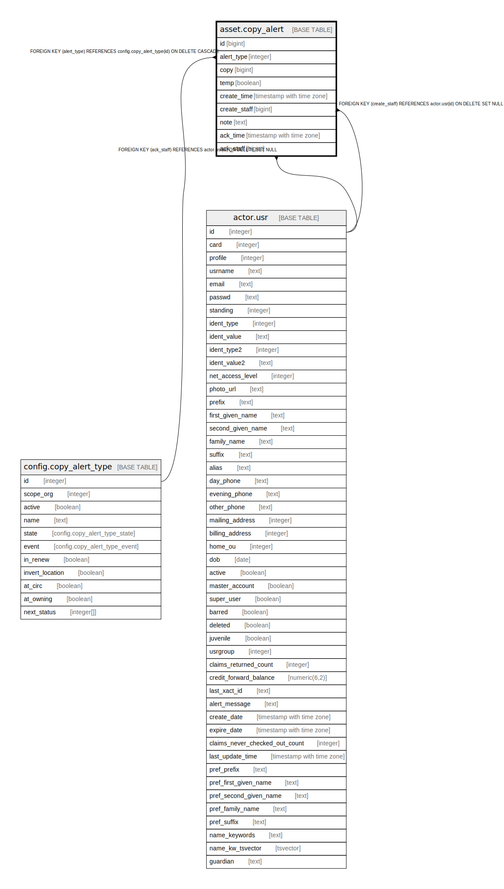

# asset.copy_alert

## Description

## Columns

| Name | Type | Default | Nullable | Children | Parents | Comment |
| ---- | ---- | ------- | -------- | -------- | ------- | ------- |
| id | bigint | nextval('asset.copy_alert_id_seq'::regclass) | false |  |  |  |
| alert_type | integer |  | false |  | [config.copy_alert_type](config.copy_alert_type.md) |  |
| copy | bigint |  | false |  |  |  |
| temp | boolean | false | false |  |  |  |
| create_time | timestamp with time zone | now() | false |  |  |  |
| create_staff | bigint |  | false |  | [actor.usr](actor.usr.md) |  |
| note | text |  | true |  |  |  |
| ack_time | timestamp with time zone |  | true |  |  |  |
| ack_staff | bigint |  | true |  | [actor.usr](actor.usr.md) |  |

## Constraints

| Name | Type | Definition |
| ---- | ---- | ---------- |
| inherit_asset_copy_alert_copy_fkey | TRIGGER | CREATE CONSTRAINT TRIGGER inherit_asset_copy_alert_copy_fkey AFTER INSERT OR UPDATE ON asset.copy_alert DEFERRABLE INITIALLY IMMEDIATE FOR EACH ROW EXECUTE PROCEDURE asset_copy_alert_copy_inh_fkey() |
| copy_alert_ack_staff_fkey | FOREIGN KEY | FOREIGN KEY (ack_staff) REFERENCES actor.usr(id) ON DELETE SET NULL |
| copy_alert_create_staff_fkey | FOREIGN KEY | FOREIGN KEY (create_staff) REFERENCES actor.usr(id) ON DELETE SET NULL |
| copy_alert_pkey | PRIMARY KEY | PRIMARY KEY (id) |
| copy_alert_alert_type_fkey | FOREIGN KEY | FOREIGN KEY (alert_type) REFERENCES config.copy_alert_type(id) ON DELETE CASCADE |

## Indexes

| Name | Definition |
| ---- | ---------- |
| copy_alert_pkey | CREATE UNIQUE INDEX copy_alert_pkey ON asset.copy_alert USING btree (id) |

## Triggers

| Name | Definition |
| ---- | ---------- |
| inherit_asset_copy_alert_copy_fkey | CREATE CONSTRAINT TRIGGER inherit_asset_copy_alert_copy_fkey AFTER INSERT OR UPDATE ON asset.copy_alert DEFERRABLE INITIALLY IMMEDIATE FOR EACH ROW EXECUTE PROCEDURE asset_copy_alert_copy_inh_fkey() |

## Relations

---

> Generated by [tbls](https://github.com/k1LoW/tbls)
