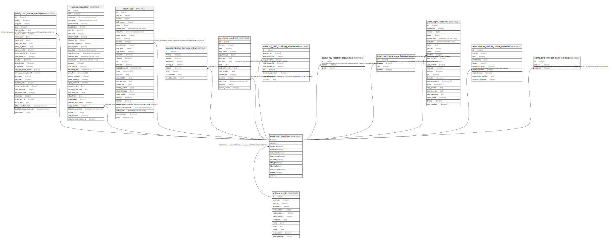

# asset.copy_location

## Description

## Columns

| Name | Type | Default | Nullable | Children | Parents | Comment |
| ---- | ---- | ------- | -------- | -------- | ------- | ------- |
| id | integer | nextval('asset.copy_location_id_seq'::regclass) | false | [config.circ_matrix_matchpoint](config.circ_matrix_matchpoint.md) [action.circulation](action.circulation.md) [asset.copy](asset.copy.md) [acq.distribution_formula_entry](acq.distribution_formula_entry.md) [acq.lineitem_detail](acq.lineitem_detail.md) [actor.org_unit_proximity_adjustment](actor.org_unit_proximity_adjustment.md) [asset.copy_location_group_map](asset.copy_location_group_map.md) [asset.copy_location_order](asset.copy_location_order.md) [asset.copy_template](asset.copy_template.md) [asset.course_module_course_materials](asset.course_module_course_materials.md) [config.circ_limit_set_copy_loc_map](config.circ_limit_set_copy_loc_map.md) |  |  |
| name | text |  | false |  |  |  |
| owning_lib | integer |  | false |  | [actor.org_unit](actor.org_unit.md) |  |
| holdable | boolean | true | false |  |  |  |
| hold_verify | boolean | false | false |  |  |  |
| opac_visible | boolean | true | false |  |  |  |
| circulate | boolean | true | false |  |  |  |
| label_prefix | text |  | true |  |  |  |
| label_suffix | text |  | true |  |  |  |
| checkin_alert | boolean | false | false |  |  |  |
| deleted | boolean | false | false |  |  |  |
| url | text |  | true |  |  |  |

## Constraints

| Name | Type | Definition |
| ---- | ---- | ---------- |
| copy_location_owning_lib_fkey | FOREIGN KEY | FOREIGN KEY (owning_lib) REFERENCES actor.org_unit(id) DEFERRABLE INITIALLY DEFERRED |
| copy_location_pkey | PRIMARY KEY | PRIMARY KEY (id) |

## Indexes

| Name | Definition |
| ---- | ---------- |
| copy_location_pkey | CREATE UNIQUE INDEX copy_location_pkey ON asset.copy_location USING btree (id) |
| acl_name_once_per_lib | CREATE UNIQUE INDEX acl_name_once_per_lib ON asset.copy_location USING btree (name, owning_lib) WHERE ((deleted = false) OR (deleted IS FALSE)) |

## Relations

---

> Generated by [tbls](https://github.com/k1LoW/tbls)
