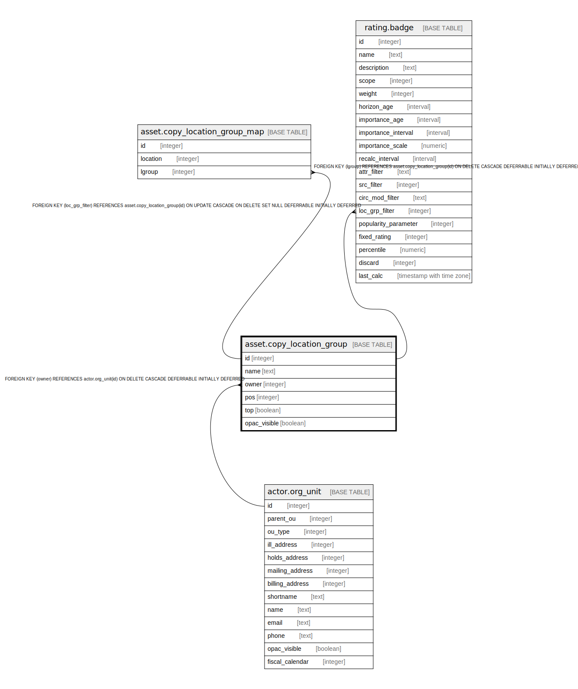

# asset.copy_location_group

## Description

## Columns

| Name | Type | Default | Nullable | Children | Parents | Comment |
| ---- | ---- | ------- | -------- | -------- | ------- | ------- |
| id | integer | nextval('asset.copy_location_group_id_seq'::regclass) | false | [asset.copy_location_group_map](asset.copy_location_group_map.md) [rating.badge](rating.badge.md) |  |  |
| name | text |  | false |  |  |  |
| owner | integer |  | false |  | [actor.org_unit](actor.org_unit.md) |  |
| pos | integer | 0 | false |  |  |  |
| top | boolean | false | false |  |  |  |
| opac_visible | boolean | true | false |  |  |  |

## Constraints

| Name | Type | Definition |
| ---- | ---- | ---------- |
| copy_location_group_owner_fkey | FOREIGN KEY | FOREIGN KEY (owner) REFERENCES actor.org_unit(id) ON DELETE CASCADE DEFERRABLE INITIALLY DEFERRED |
| copy_location_group_pkey | PRIMARY KEY | PRIMARY KEY (id) |
| lgroup_once_per_owner | UNIQUE | UNIQUE (owner, name) |

## Indexes

| Name | Definition |
| ---- | ---------- |
| copy_location_group_pkey | CREATE UNIQUE INDEX copy_location_group_pkey ON asset.copy_location_group USING btree (id) |
| lgroup_once_per_owner | CREATE UNIQUE INDEX lgroup_once_per_owner ON asset.copy_location_group USING btree (owner, name) |

## Relations

---

> Generated by [tbls](https://github.com/k1LoW/tbls)
