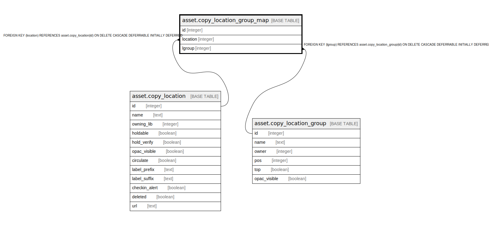

# asset.copy_location_group_map

## Description

## Columns

| Name | Type | Default | Nullable | Children | Parents | Comment |
| ---- | ---- | ------- | -------- | -------- | ------- | ------- |
| id | integer | nextval('asset.copy_location_group_map_id_seq'::regclass) | false |  |  |  |
| location | integer |  | false |  | [asset.copy_location](asset.copy_location.md) |  |
| lgroup | integer |  | false |  | [asset.copy_location_group](asset.copy_location_group.md) |  |

## Constraints

| Name | Type | Definition |
| ---- | ---- | ---------- |
| copy_location_group_map_pkey | PRIMARY KEY | PRIMARY KEY (id) |
| copy_location_group_map_lgroup_fkey | FOREIGN KEY | FOREIGN KEY (lgroup) REFERENCES asset.copy_location_group(id) ON DELETE CASCADE DEFERRABLE INITIALLY DEFERRED |
| copy_location_group_map_location_fkey | FOREIGN KEY | FOREIGN KEY (location) REFERENCES asset.copy_location(id) ON DELETE CASCADE DEFERRABLE INITIALLY DEFERRED |
| lgroup_once_per_group | UNIQUE | UNIQUE (lgroup, location) |

## Indexes

| Name | Definition |
| ---- | ---------- |
| copy_location_group_map_pkey | CREATE UNIQUE INDEX copy_location_group_map_pkey ON asset.copy_location_group_map USING btree (id) |
| lgroup_once_per_group | CREATE UNIQUE INDEX lgroup_once_per_group ON asset.copy_location_group_map USING btree (lgroup, location) |

## Relations

---

> Generated by [tbls](https://github.com/k1LoW/tbls)
