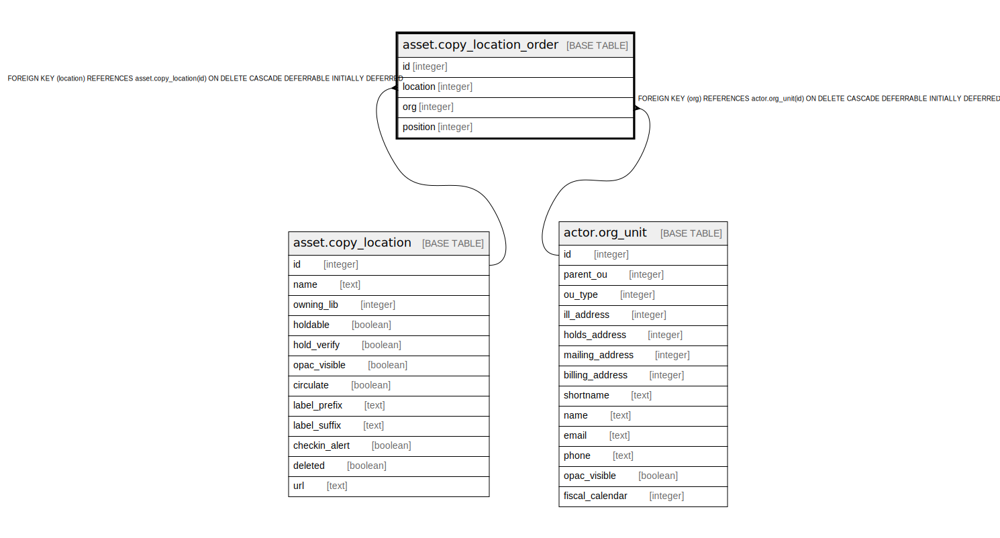

# asset.copy_location_order

## Description

## Columns

| Name | Type | Default | Nullable | Children | Parents | Comment |
| ---- | ---- | ------- | -------- | -------- | ------- | ------- |
| id | integer | nextval('asset.copy_location_order_id_seq'::regclass) | false |  |  |  |
| location | integer |  | false |  | [asset.copy_location](asset.copy_location.md) |  |
| org | integer |  | false |  | [actor.org_unit](actor.org_unit.md) |  |
| position | integer | 0 | false |  |  |  |

## Constraints

| Name | Type | Definition |
| ---- | ---- | ---------- |
| copy_location_order_org_fkey | FOREIGN KEY | FOREIGN KEY (org) REFERENCES actor.org_unit(id) ON DELETE CASCADE DEFERRABLE INITIALLY DEFERRED |
| acplo_once_per_org | UNIQUE | UNIQUE (location, org) |
| copy_location_order_pkey | PRIMARY KEY | PRIMARY KEY (id) |
| copy_location_order_location_fkey | FOREIGN KEY | FOREIGN KEY (location) REFERENCES asset.copy_location(id) ON DELETE CASCADE DEFERRABLE INITIALLY DEFERRED |

## Indexes

| Name | Definition |
| ---- | ---------- |
| acplo_once_per_org | CREATE UNIQUE INDEX acplo_once_per_org ON asset.copy_location_order USING btree (location, org) |
| copy_location_order_pkey | CREATE UNIQUE INDEX copy_location_order_pkey ON asset.copy_location_order USING btree (id) |

## Relations

---

> Generated by [tbls](https://github.com/k1LoW/tbls)
