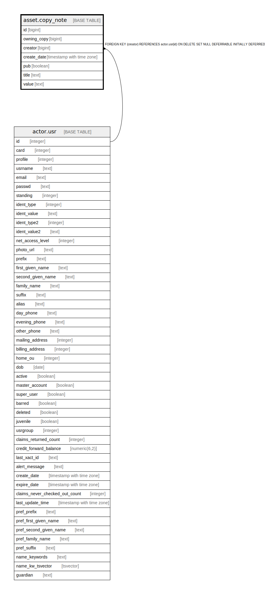

# asset.copy_note

## Description

## Columns

| Name | Type | Default | Nullable | Children | Parents | Comment |
| ---- | ---- | ------- | -------- | -------- | ------- | ------- |
| id | bigint | nextval('asset.copy_note_id_seq'::regclass) | false |  |  |  |
| owning_copy | bigint |  | false |  |  |  |
| creator | bigint |  | false |  | [actor.usr](actor.usr.md) |  |
| create_date | timestamp with time zone | now() | true |  |  |  |
| pub | boolean | false | false |  |  |  |
| title | text |  | false |  |  |  |
| value | text |  | false |  |  |  |

## Constraints

| Name | Type | Definition |
| ---- | ---- | ---------- |
| inherit_asset_copy_note_copy_fkey | TRIGGER | CREATE CONSTRAINT TRIGGER inherit_asset_copy_note_copy_fkey AFTER INSERT OR UPDATE ON asset.copy_note DEFERRABLE INITIALLY IMMEDIATE FOR EACH ROW EXECUTE PROCEDURE asset_copy_note_owning_copy_inh_fkey() |
| asset_copy_note_creator_fkey | FOREIGN KEY | FOREIGN KEY (creator) REFERENCES actor.usr(id) ON DELETE SET NULL DEFERRABLE INITIALLY DEFERRED |
| copy_note_pkey | PRIMARY KEY | PRIMARY KEY (id) |

## Indexes

| Name | Definition |
| ---- | ---------- |
| copy_note_pkey | CREATE UNIQUE INDEX copy_note_pkey ON asset.copy_note USING btree (id) |
| asset_copy_note_creator_idx | CREATE INDEX asset_copy_note_creator_idx ON asset.copy_note USING btree (creator) |
| asset_copy_note_owning_copy_idx | CREATE INDEX asset_copy_note_owning_copy_idx ON asset.copy_note USING btree (owning_copy) |

## Triggers

| Name | Definition |
| ---- | ---------- |
| inherit_asset_copy_note_copy_fkey | CREATE CONSTRAINT TRIGGER inherit_asset_copy_note_copy_fkey AFTER INSERT OR UPDATE ON asset.copy_note DEFERRABLE INITIALLY IMMEDIATE FOR EACH ROW EXECUTE PROCEDURE asset_copy_note_owning_copy_inh_fkey() |

## Relations

---

> Generated by [tbls](https://github.com/k1LoW/tbls)
