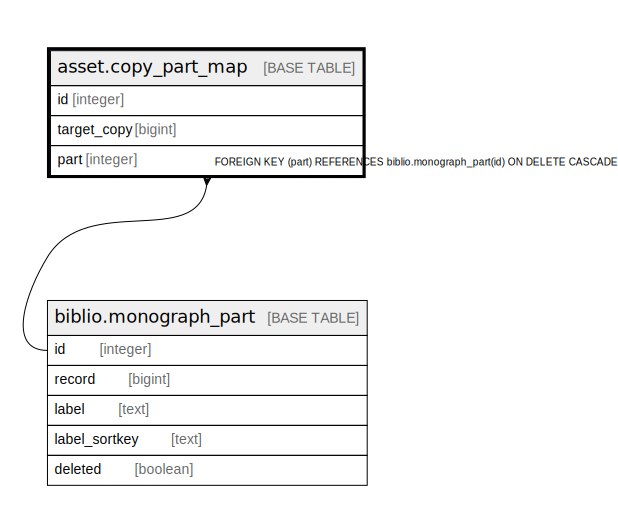

# asset.copy_part_map

## Description

## Columns

| Name | Type | Default | Nullable | Children | Parents | Comment |
| ---- | ---- | ------- | -------- | -------- | ------- | ------- |
| id | integer | nextval('asset.copy_part_map_id_seq'::regclass) | false |  |  |  |
| target_copy | bigint |  | false |  |  |  |
| part | integer |  | false |  | [biblio.monograph_part](biblio.monograph_part.md) |  |

## Constraints

| Name | Type | Definition |
| ---- | ---- | ---------- |
| copy_part_map_pkey | PRIMARY KEY | PRIMARY KEY (id) |
| copy_part_map_part_fkey | FOREIGN KEY | FOREIGN KEY (part) REFERENCES biblio.monograph_part(id) ON DELETE CASCADE |

## Indexes

| Name | Definition |
| ---- | ---------- |
| copy_part_map_pkey | CREATE UNIQUE INDEX copy_part_map_pkey ON asset.copy_part_map USING btree (id) |
| copy_part_map_cp_part_idx | CREATE UNIQUE INDEX copy_part_map_cp_part_idx ON asset.copy_part_map USING btree (target_copy, part) |

## Relations

---

> Generated by [tbls](https://github.com/k1LoW/tbls)
