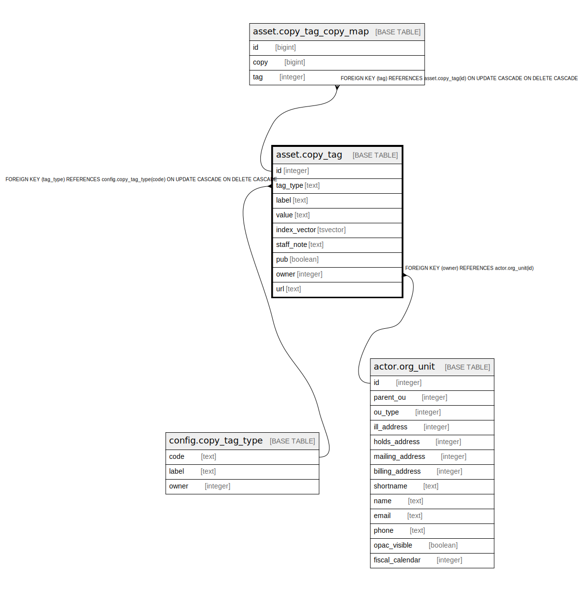

# asset.copy_tag

## Description

## Columns

| Name | Type | Default | Nullable | Children | Parents | Comment |
| ---- | ---- | ------- | -------- | -------- | ------- | ------- |
| id | integer | nextval('asset.copy_tag_id_seq'::regclass) | false | [asset.copy_tag_copy_map](asset.copy_tag_copy_map.md) |  |  |
| tag_type | text |  | true |  | [config.copy_tag_type](config.copy_tag_type.md) |  |
| label | text |  | false |  |  |  |
| value | text |  | false |  |  |  |
| index_vector | tsvector |  | false |  |  |  |
| staff_note | text |  | true |  |  |  |
| pub | boolean | true | true |  |  |  |
| owner | integer |  | false |  | [actor.org_unit](actor.org_unit.md) |  |
| url | text |  | true |  |  |  |

## Constraints

| Name | Type | Definition |
| ---- | ---- | ---------- |
| copy_tag_owner_fkey | FOREIGN KEY | FOREIGN KEY (owner) REFERENCES actor.org_unit(id) |
| copy_tag_pkey | PRIMARY KEY | PRIMARY KEY (id) |
| copy_tag_tag_type_fkey | FOREIGN KEY | FOREIGN KEY (tag_type) REFERENCES config.copy_tag_type(code) ON UPDATE CASCADE ON DELETE CASCADE |

## Indexes

| Name | Definition |
| ---- | ---------- |
| copy_tag_pkey | CREATE UNIQUE INDEX copy_tag_pkey ON asset.copy_tag USING btree (id) |
| asset_copy_tag_index_vector_idx | CREATE INDEX asset_copy_tag_index_vector_idx ON asset.copy_tag USING gin (index_vector) |
| asset_copy_tag_label_idx | CREATE INDEX asset_copy_tag_label_idx ON asset.copy_tag USING btree (label) |
| asset_copy_tag_label_lower_idx | CREATE INDEX asset_copy_tag_label_lower_idx ON asset.copy_tag USING btree (lowercase(label)) |
| asset_copy_tag_owner_idx | CREATE INDEX asset_copy_tag_owner_idx ON asset.copy_tag USING btree (owner) |
| asset_copy_tag_tag_type_idx | CREATE INDEX asset_copy_tag_tag_type_idx ON asset.copy_tag USING btree (tag_type) |

## Triggers

| Name | Definition |
| ---- | ---------- |
| asset_copy_tag_do_value | CREATE TRIGGER asset_copy_tag_do_value BEFORE INSERT OR UPDATE ON asset.copy_tag FOR EACH ROW EXECUTE PROCEDURE asset.set_copy_tag_value() |
| asset_copy_tag_fti_trigger | CREATE TRIGGER asset_copy_tag_fti_trigger BEFORE INSERT OR UPDATE ON asset.copy_tag FOR EACH ROW EXECUTE PROCEDURE oils_tsearch2('default') |

## Relations

---

> Generated by [tbls](https://github.com/k1LoW/tbls)
