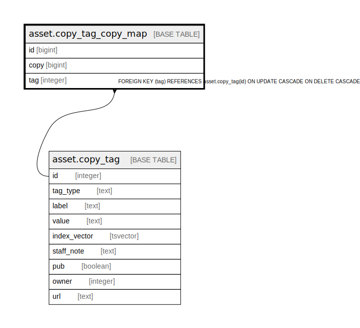

# asset.copy_tag_copy_map

## Description

## Columns

| Name | Type | Default | Nullable | Children | Parents | Comment |
| ---- | ---- | ------- | -------- | -------- | ------- | ------- |
| id | bigint | nextval('asset.copy_tag_copy_map_id_seq'::regclass) | false |  |  |  |
| copy | bigint |  | true |  |  |  |
| tag | integer |  | true |  | [asset.copy_tag](asset.copy_tag.md) |  |

## Constraints

| Name | Type | Definition |
| ---- | ---- | ---------- |
| inherit_asset_copy_tag_copy_map_copy_fkey | TRIGGER | CREATE CONSTRAINT TRIGGER inherit_asset_copy_tag_copy_map_copy_fkey AFTER INSERT OR UPDATE ON asset.copy_tag_copy_map DEFERRABLE INITIALLY IMMEDIATE FOR EACH ROW EXECUTE PROCEDURE asset_copy_tag_copy_map_copy_inh_fkey() |
| copy_tag_copy_map_pkey | PRIMARY KEY | PRIMARY KEY (id) |
| copy_tag_copy_map_tag_fkey | FOREIGN KEY | FOREIGN KEY (tag) REFERENCES asset.copy_tag(id) ON UPDATE CASCADE ON DELETE CASCADE |

## Indexes

| Name | Definition |
| ---- | ---------- |
| copy_tag_copy_map_pkey | CREATE UNIQUE INDEX copy_tag_copy_map_pkey ON asset.copy_tag_copy_map USING btree (id) |
| asset_copy_tag_copy_map_copy_idx | CREATE INDEX asset_copy_tag_copy_map_copy_idx ON asset.copy_tag_copy_map USING btree (copy) |
| asset_copy_tag_copy_map_tag_idx | CREATE INDEX asset_copy_tag_copy_map_tag_idx ON asset.copy_tag_copy_map USING btree (tag) |

## Triggers

| Name | Definition |
| ---- | ---------- |
| inherit_asset_copy_tag_copy_map_copy_fkey | CREATE CONSTRAINT TRIGGER inherit_asset_copy_tag_copy_map_copy_fkey AFTER INSERT OR UPDATE ON asset.copy_tag_copy_map DEFERRABLE INITIALLY IMMEDIATE FOR EACH ROW EXECUTE PROCEDURE asset_copy_tag_copy_map_copy_inh_fkey() |

## Relations

---

> Generated by [tbls](https://github.com/k1LoW/tbls)
