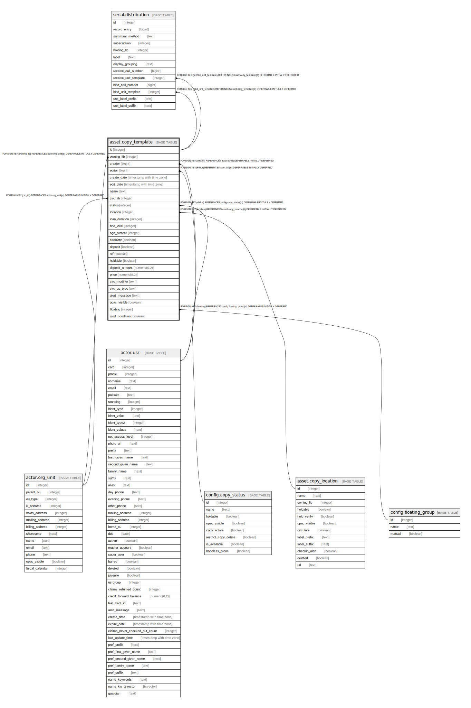

# asset.copy_template

## Description

## Columns

| Name | Type | Default | Nullable | Children | Parents | Comment |
| ---- | ---- | ------- | -------- | -------- | ------- | ------- |
| id | integer | nextval('asset.copy_template_id_seq'::regclass) | false | [serial.distribution](serial.distribution.md) |  |  |
| owning_lib | integer |  | false |  | [actor.org_unit](actor.org_unit.md) |  |
| creator | bigint |  | false |  | [actor.usr](actor.usr.md) |  |
| editor | bigint |  | false |  | [actor.usr](actor.usr.md) |  |
| create_date | timestamp with time zone | now() | true |  |  |  |
| edit_date | timestamp with time zone | now() | true |  |  |  |
| name | text |  | false |  |  |  |
| circ_lib | integer |  | true |  | [actor.org_unit](actor.org_unit.md) |  |
| status | integer |  | true |  | [config.copy_status](config.copy_status.md) |  |
| location | integer |  | true |  | [asset.copy_location](asset.copy_location.md) |  |
| loan_duration | integer |  | true |  |  |  |
| fine_level | integer |  | true |  |  |  |
| age_protect | integer |  | true |  |  |  |
| circulate | boolean |  | true |  |  |  |
| deposit | boolean |  | true |  |  |  |
| ref | boolean |  | true |  |  |  |
| holdable | boolean |  | true |  |  |  |
| deposit_amount | numeric(6,2) |  | true |  |  |  |
| price | numeric(8,2) |  | true |  |  |  |
| circ_modifier | text |  | true |  |  |  |
| circ_as_type | text |  | true |  |  |  |
| alert_message | text |  | true |  |  |  |
| opac_visible | boolean |  | true |  |  |  |
| floating | integer |  | true |  | [config.floating_group](config.floating_group.md) |  |
| mint_condition | boolean |  | true |  |  |  |

## Constraints

| Name | Type | Definition |
| ---- | ---- | ---------- |
| valid_fine_level | CHECK | CHECK (((fine_level IS NULL) OR (loan_duration = ANY (ARRAY[1, 2, 3])))) |
| valid_loan_duration | CHECK | CHECK (((loan_duration IS NULL) OR (loan_duration = ANY (ARRAY[1, 2, 3])))) |
| copy_template_circ_lib_fkey | FOREIGN KEY | FOREIGN KEY (circ_lib) REFERENCES actor.org_unit(id) DEFERRABLE INITIALLY DEFERRED |
| copy_template_owning_lib_fkey | FOREIGN KEY | FOREIGN KEY (owning_lib) REFERENCES actor.org_unit(id) DEFERRABLE INITIALLY DEFERRED |
| copy_template_creator_fkey | FOREIGN KEY | FOREIGN KEY (creator) REFERENCES actor.usr(id) DEFERRABLE INITIALLY DEFERRED |
| copy_template_editor_fkey | FOREIGN KEY | FOREIGN KEY (editor) REFERENCES actor.usr(id) DEFERRABLE INITIALLY DEFERRED |
| copy_template_location_fkey | FOREIGN KEY | FOREIGN KEY (location) REFERENCES asset.copy_location(id) DEFERRABLE INITIALLY DEFERRED |
| copy_template_pkey | PRIMARY KEY | PRIMARY KEY (id) |
| copy_template_status_fkey | FOREIGN KEY | FOREIGN KEY (status) REFERENCES config.copy_status(id) DEFERRABLE INITIALLY DEFERRED |
| asset_copy_template_floating_fkey | FOREIGN KEY | FOREIGN KEY (floating) REFERENCES config.floating_group(id) DEFERRABLE INITIALLY DEFERRED |

## Indexes

| Name | Definition |
| ---- | ---------- |
| copy_template_pkey | CREATE UNIQUE INDEX copy_template_pkey ON asset.copy_template USING btree (id) |

## Relations

---

> Generated by [tbls](https://github.com/k1LoW/tbls)
