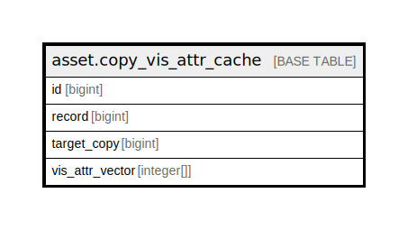

# asset.copy_vis_attr_cache

## Description

## Columns

| Name | Type | Default | Nullable | Children | Parents | Comment |
| ---- | ---- | ------- | -------- | -------- | ------- | ------- |
| id | bigint | nextval('asset.copy_vis_attr_cache_id_seq'::regclass) | false |  |  |  |
| record | bigint |  | false |  |  |  |
| target_copy | bigint |  | false |  |  |  |
| vis_attr_vector | integer[] |  | true |  |  |  |

## Constraints

| Name | Type | Definition |
| ---- | ---- | ---------- |
| copy_vis_attr_cache_pkey | PRIMARY KEY | PRIMARY KEY (id) |

## Indexes

| Name | Definition |
| ---- | ---------- |
| copy_vis_attr_cache_pkey | CREATE UNIQUE INDEX copy_vis_attr_cache_pkey ON asset.copy_vis_attr_cache USING btree (id) |
| copy_vis_attr_cache_copy_idx | CREATE INDEX copy_vis_attr_cache_copy_idx ON asset.copy_vis_attr_cache USING btree (target_copy) |
| copy_vis_attr_cache_record_idx | CREATE INDEX copy_vis_attr_cache_record_idx ON asset.copy_vis_attr_cache USING btree (record) |

## Relations

---

> Generated by [tbls](https://github.com/k1LoW/tbls)
